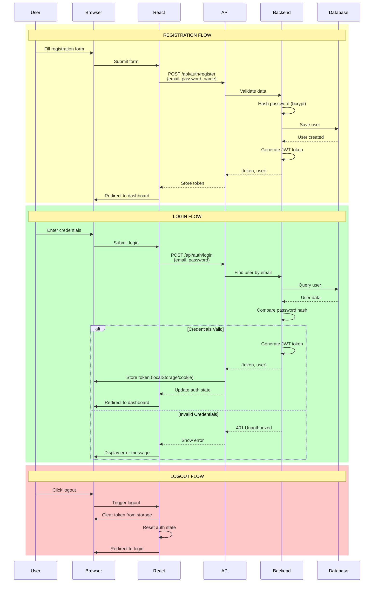
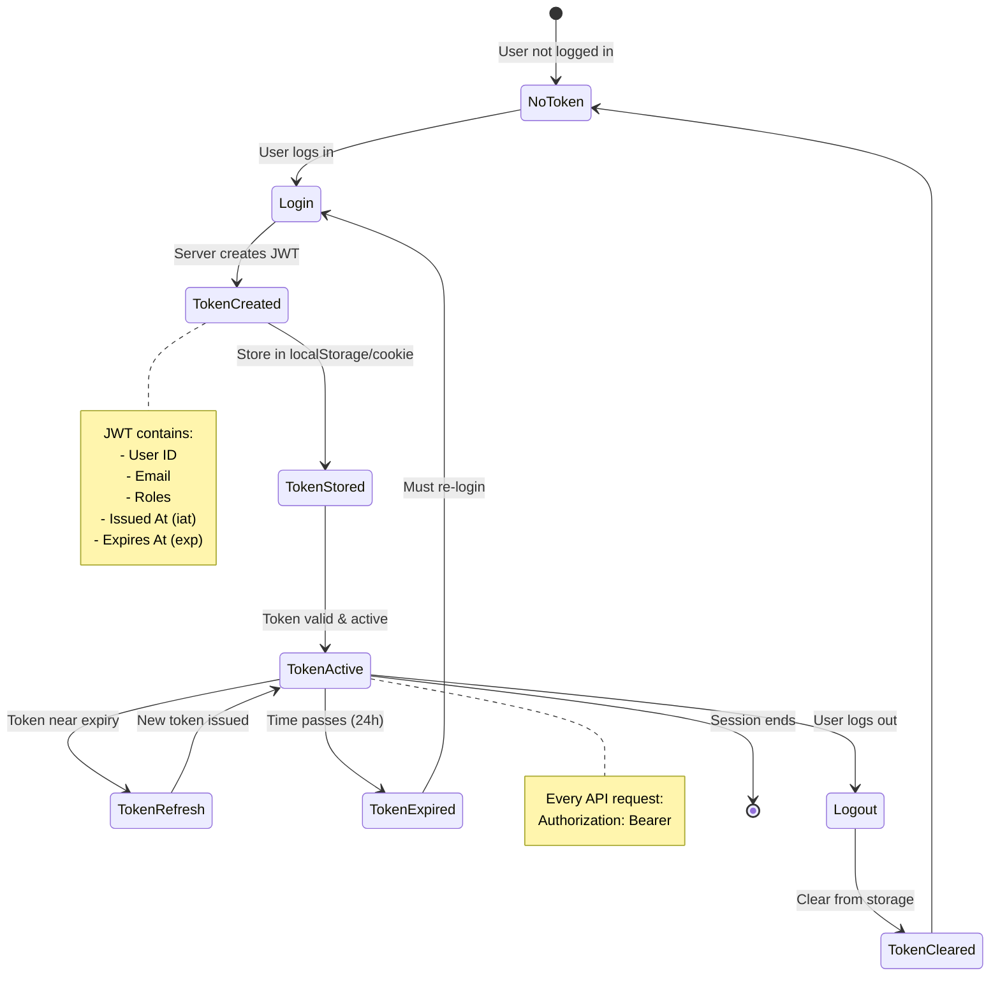
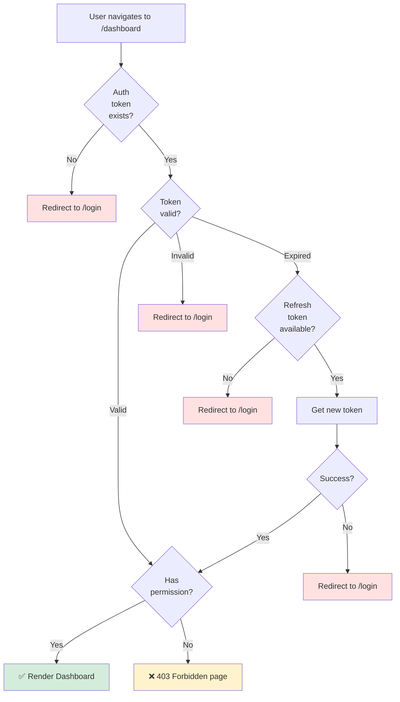
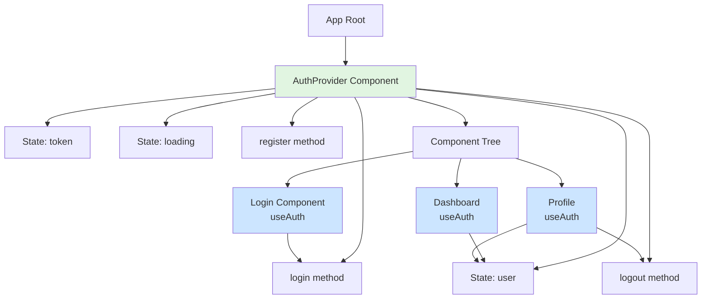
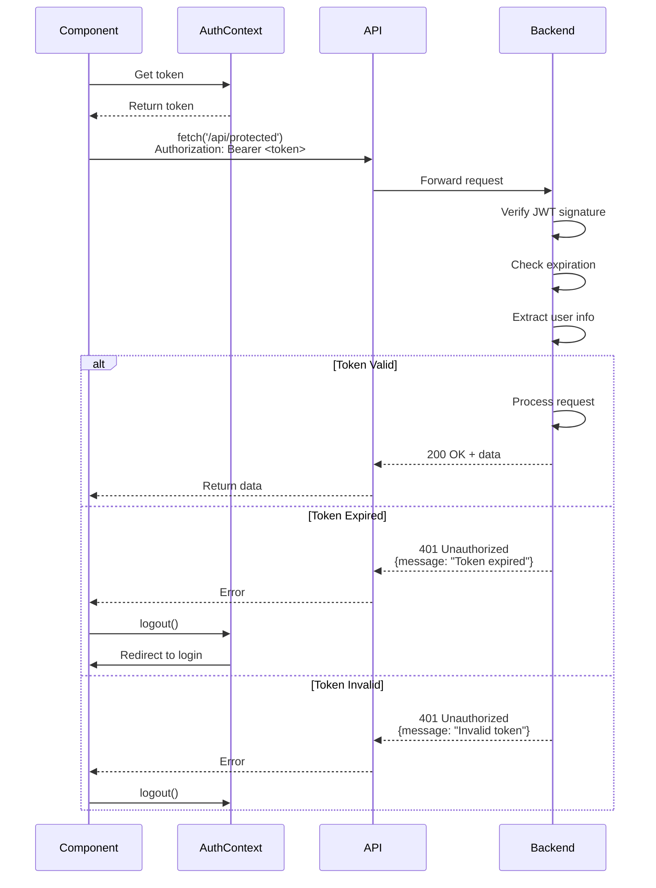
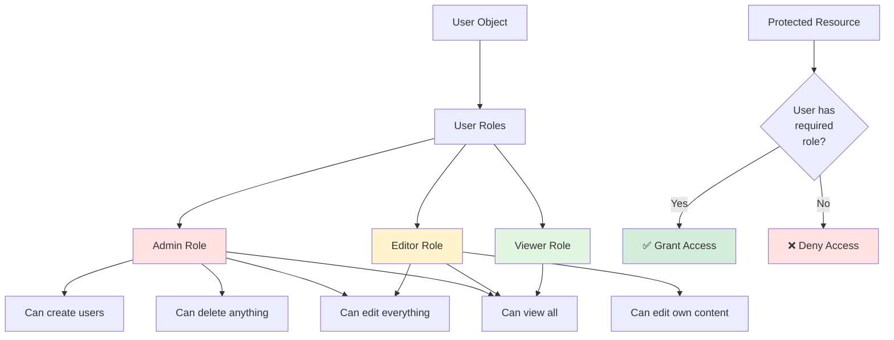
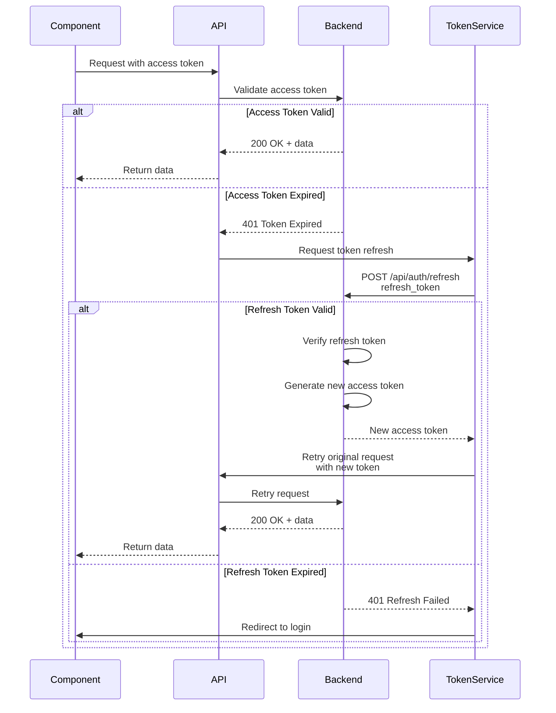
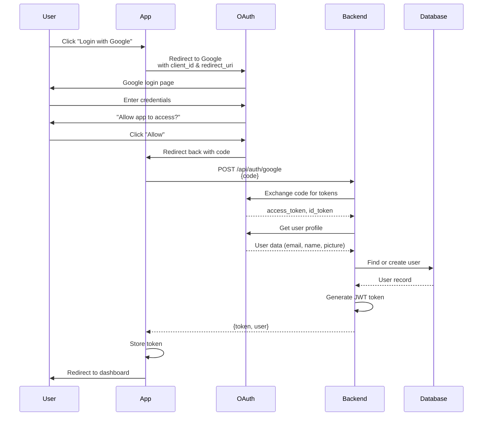
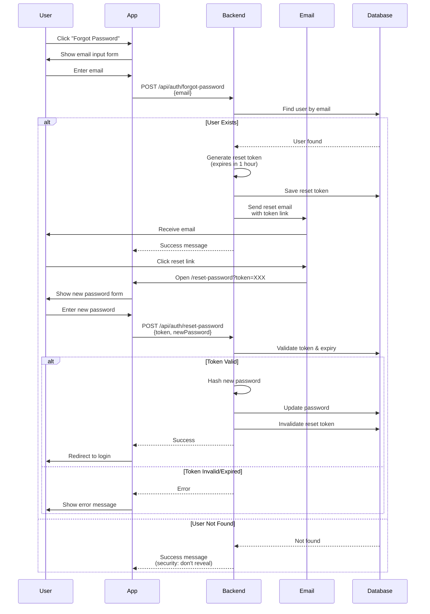
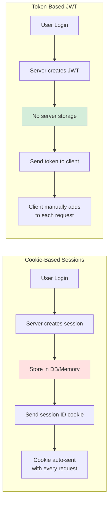

# Authentication & Authorization Flow Diagrams

## 1. Complete Authentication Flow

---

## 2. JWT Token Lifecycle

---

## 3. Protected Route Flow

---

## 4. Auth Context Provider Pattern

---

## 5. API Request with Auth Token

---

## 6. Role-Based Access Control (RBAC)

---

## 7. Token Refresh Flow

---

## 8. Social OAuth Flow (Google/GitHub)

---

## 9. Password Reset Flow

---

## 10. Session Management Comparison

** Comparison**

| Feature | Cookie Sessions | JWT Tokens |
|---------|----------------|------------|
| Storage | Server-side (DB/Redis) | Client-side (localStorage) |
| Scalability | Harder (session store) | Easier (stateless) |
| Security | More secure (httpOnly) | Less secure (XSS risk) |
| Size | Small cookie | Larger payload |
| Revocation | Easy (delete session) | Hard (needs blacklist) |
| CORS | Tricky | Easy |

---

** Created** October 6, 2025
** For** React Course - LongNDT **Topic** Authentication & Authorization **Related Lessons** Lesson 4
