# React Component Lifecycle & Hooks Diagrams

## 1. Component Lifecycle Overview

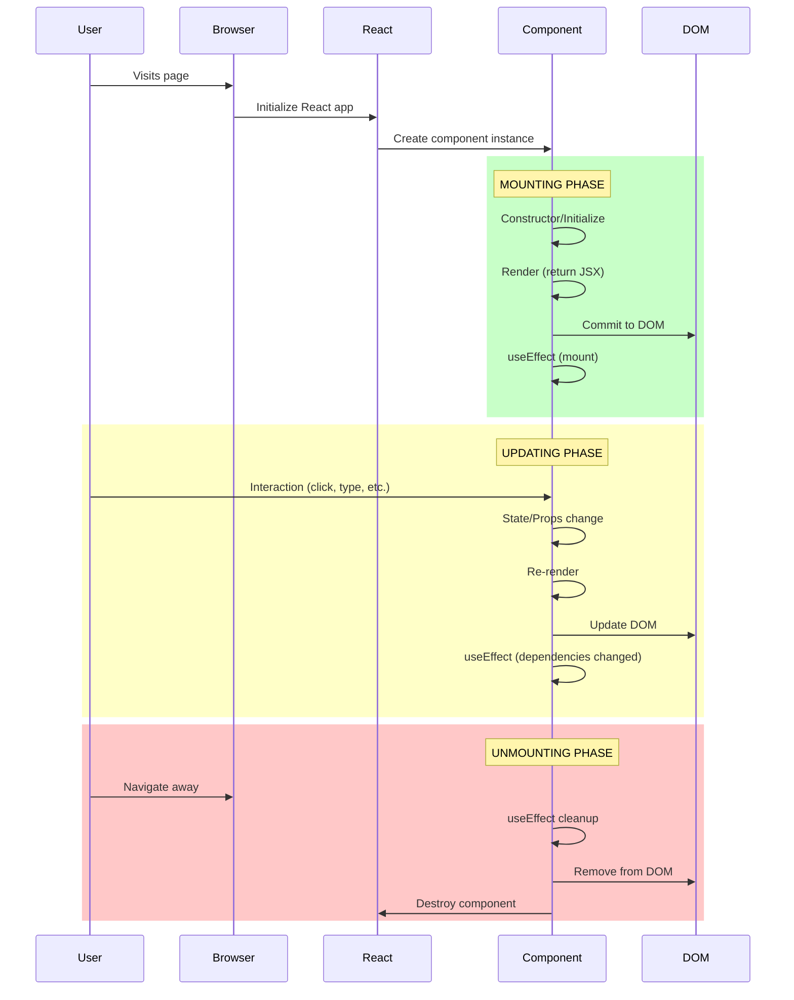

---

## 2. Functional Component Render Cycle

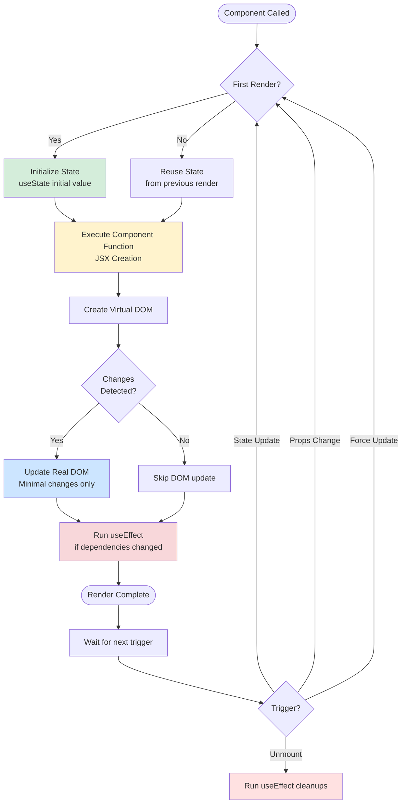

---

## 3. useState Hook Lifecycle

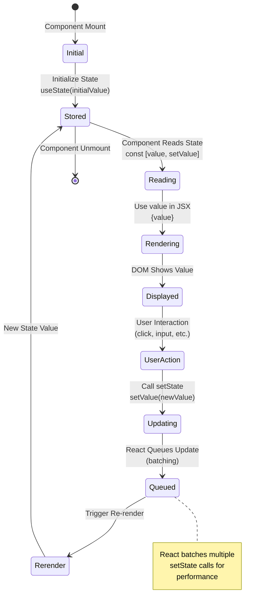

---

## 4. useEffect Hook Execution Timeline

```mermaid
gantt
    title useEffect Execution During Component Lifecycle
    dateFormat X
    axisFormat %L

    section First Render
    Component Function Runs        :a1, 0, 10
    JSX Creation                   :a2, 10, 20
    DOM Commit                     :a3, 20, 30
    useEffect (mount) Runs         :crit, a4, 30, 40
    Browser Paint                  :a5, 40, 50

    section State Update
    setState Called                :b1, 50, 55
    Component Re-runs              :b2, 55, 65
    JSX Re-creation                :b3, 65, 75
    DOM Update                     :b4, 75, 85
    useEffect (update) Runs        :crit, b5, 85, 95
    Browser Repaint                :b6, 95, 105

    section Unmount
    Navigation/Unmount Trigger     :c1, 105, 110
    useEffect Cleanup Runs         :crit, c2, 110, 120
    Component Destroyed            :c3, 120, 130
```

---

## 5. Multiple Hooks Execution Order

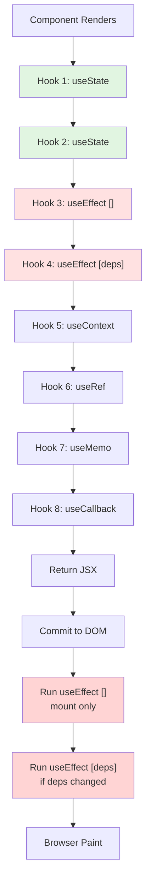

**Rules**:
1. ✅ Hooks must be called in the **same order** every render
2. ✅ Hooks must be at the **top level** (not in conditions/loops)
3. ✅ `useEffect` runs **after** render and DOM commit
4. ✅ Multiple `useEffect` hooks run in **order of declaration**

---

## 6. useEffect Dependency Array Behavior

```mermaid
graph TD
    Component[Component Renders] --> Check{useEffect<br/>Dependency Array?}

    Check -->|No array| Always[Runs on EVERY render<br/>useEffect#40;#41; => {...}#41;]
    Check -->|Empty array #91;#93;| Once[Runs ONCE on mount<br/>useEffect#40;#41; => {...}, #91;#93;#41;]
    Check -->|With deps #91;a, b#93;| Compare{Dependencies<br/>Changed?}

    Compare -->|Yes| Run[Run Effect]
    Compare -->|No| Skip[Skip Effect]

    Always --> Cleanup1{Cleanup<br/>Function?}
    Once --> Cleanup2{Cleanup<br/>Function?}
    Run --> Cleanup3{Cleanup<br/>Function?}

    Cleanup1 -->|Yes| Clean1[Run cleanup on<br/>EVERY re-render]
    Cleanup2 -->|Yes| Clean2[Run cleanup on<br/>UNMOUNT only]
    Cleanup3 -->|Yes| Clean3[Run cleanup when<br/>deps change or unmount]

    style Always fill:#ffe1e1
    style Once fill:#d4edda
    style Run fill:#fff3cd
    style Skip fill:#e7f3ff
```

---

## 7. Component Re-render Triggers

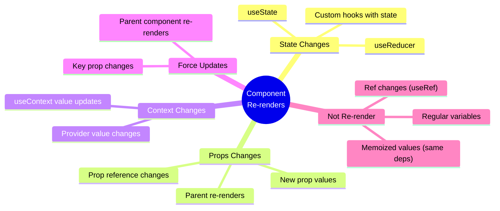

---

## 8. Batching and Async Updates

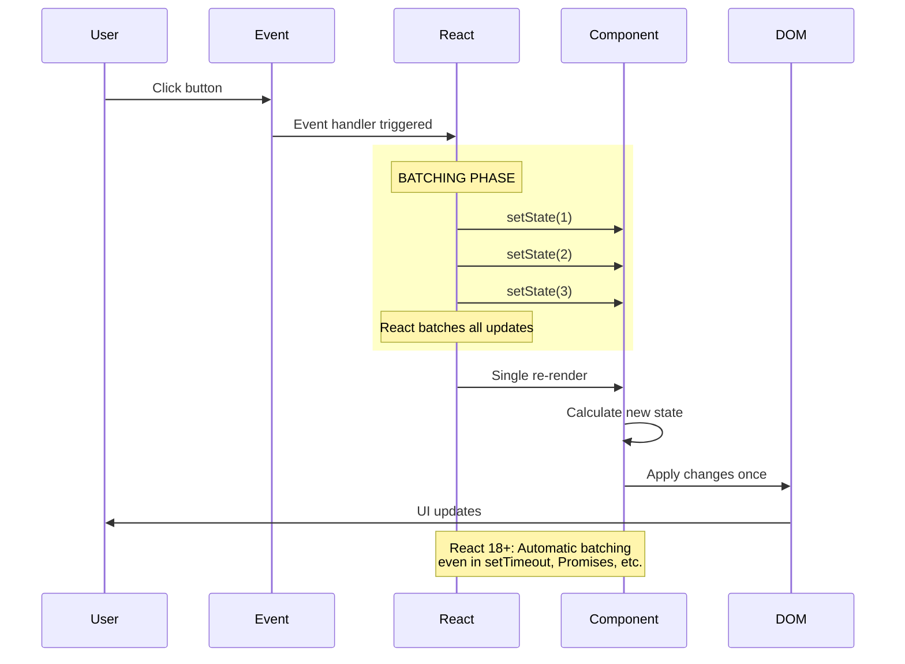

---

## 9. Custom Hook Lifecycle

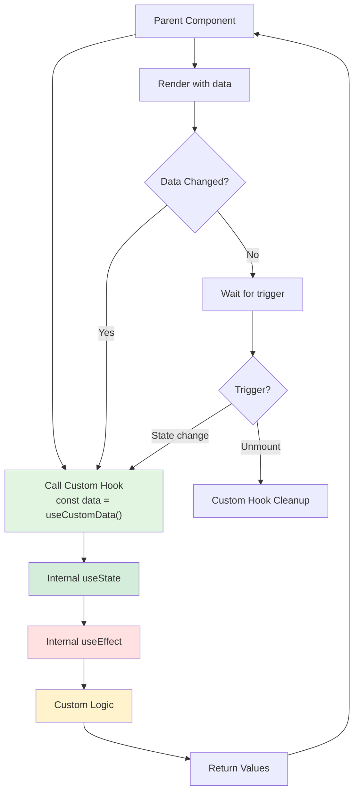

**Example**:
```typescript
function useCustomData() {
  const [data, setData] = useState(null);

  useEffect(() => {
    fetchData().then(setData);
    return () => cleanup(); // Cleanup
  }, []);

  return data;
}
```

---

## 10. Component vs Hook Lifecycle Comparison

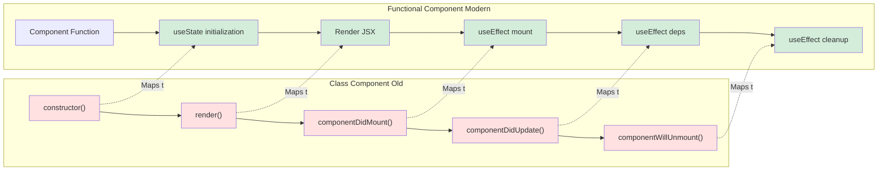

---

## 11. Memory Leak Prevention with useEffect

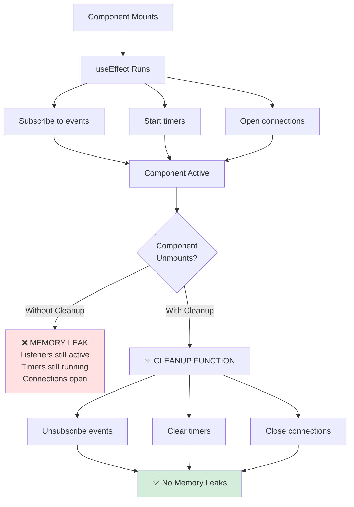

**Example with Cleanup**:
```typescript
useEffect(() => {
  const timer = setInterval(() => {
    console.log('tick');
  }, 1000);

  // Cleanup function
  return () => {
    clearInterval(timer); // ✅ Prevents memory leak
  };
}, []);
```

---

## 12. Strict Mode Double Rendering (Development)

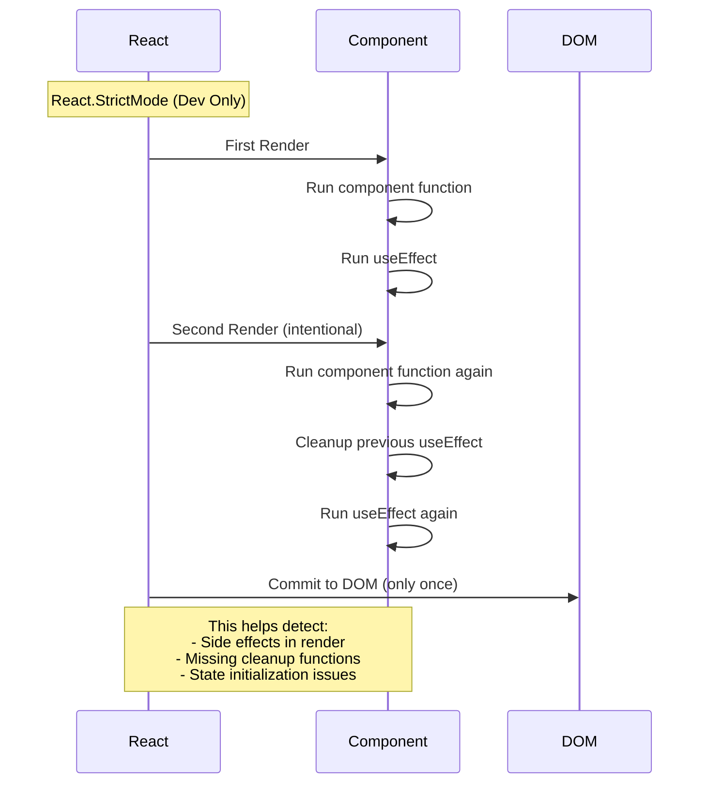

**Why?**: React 18+ runs components twice in development to help you catch bugs early.

---

**Created**: October 6, 2025
**For**: React Course - LongNDT
**Topic**: Component Lifecycle & Hooks
**Related Lessons**: Lesson 1, Lesson 2
