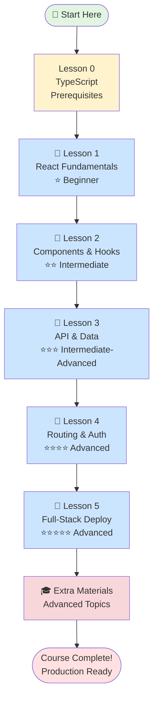
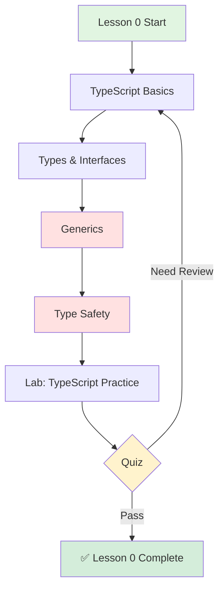
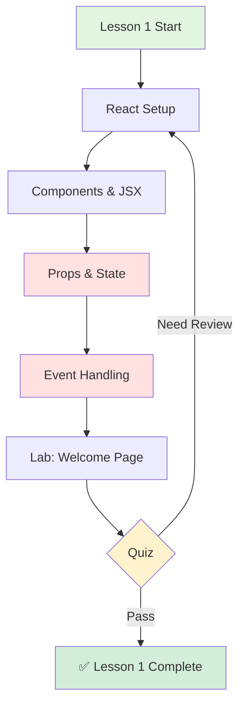
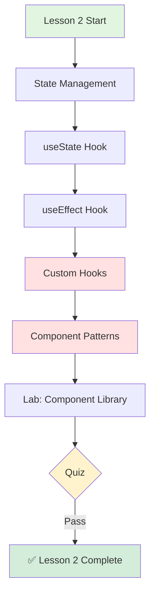
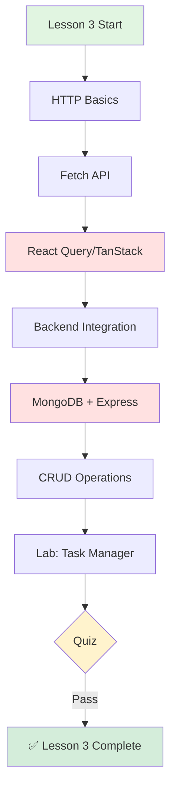
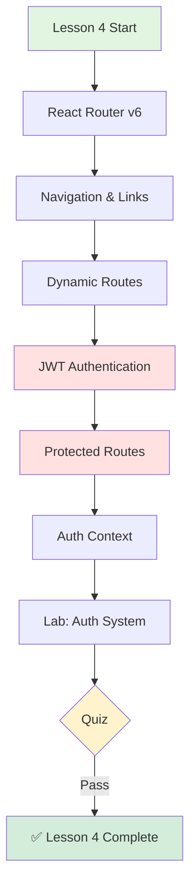
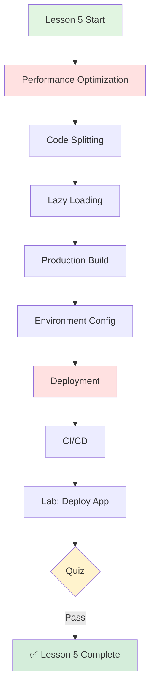
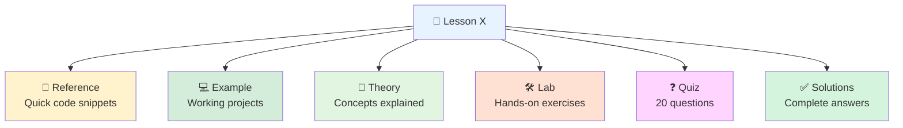

# 🗺️ React Course Learning Roadmap (TypeScript)

---

## Visual Learning Path

---

## TypeScript Learning Path

### 🎯 Lesson 0: TypeScript Prerequisites (Foundation)
**Difficulty**: ⭐ Beginner
**Time**: 2-3 days
**Requires**: HTML, CSS, Basic JavaScript

**Key Topics**:
- TypeScript fundamentals (types, interfaces, generics)
- Type annotations and type inference
- Interface definitions for props and state
- Union and intersection types
- Utility types (Partial, Pick, Omit, etc.)
- Type guards and type assertions

**TypeScript Features**:
- Basic type system
- Interface definitions
- Generic programming
- Type safety patterns
- Advanced type utilities

**Lab Project**: TypeScript Practice Exercises

---

### 📘 Lesson 1: React Fundamentals with TypeScript
**Difficulty**: ⭐ Beginner
**Time**: 1 week
**Requires**: Lesson 0

**Key Topics**:
- TSX syntax and type-safe expressions
- Functional components with TypeScript
- Props with interfaces and types
- Type-safe event handling
- Virtual DOM concepts
- Vite setup with TypeScript

**TypeScript Features**:
- Component props interfaces
- Event handler types
- Type inference in JSX
- Generic components

**Lab Project**: Welcome Page Application (TypeScript)

---

### 📘 Lesson 2: Components & Hooks
**Difficulty**: ⭐⭐ Intermediate
**Time**: 1-2 weeks
**Requires**: Lesson 1

**Key Topics**:
- useState with type parameters
- useEffect with proper types
- useRef and useContext (typed)
- Custom hooks with TypeScript
- Component composition patterns
- Higher-Order Components (HOC)
- Render props with generics

**TypeScript Features**:
- Typed state management
- Generic custom hooks
- Strict null checks
- Type inference in hooks

**Lab Project**: Reusable Component Library (TypeScript)

---

### 📘 Lesson 3: API Integration & Data
**Difficulty**: ⭐⭐⭐ Intermediate-Advanced
**Time**: 2 weeks
**Requires**: Lessons 1-2

**Key Topics**:
- REST API with typed responses
- HTTP methods with TypeScript
- React Query with type safety
- Loading and error state types
- Backend with Express + TypeScript
- MongoDB with Mongoose schemas
- CORS configuration

**TypeScript Features**:
- API response types
- Type-safe data fetching
- Generic API hooks
- Error type handling

**Lab Project**: Full-Stack Task Manager (TypeScript)

---

### 📘 Lesson 4: Routing & Authentication
**Difficulty**: ⭐⭐⭐⭐ Advanced
**Time**: 2 weeks
**Requires**: Lessons 1-3

**Key Topics**:
- React Router v6 with TypeScript
- Typed route configuration
- Navigation with type safety
- URL parameters (typed)
- JWT authentication (typed tokens)
- Login/Register with form types
- Protected routes with type guards
- Auth context with TypeScript

**TypeScript Features**:
- Route parameter types
- Auth context types
- JWT payload interfaces
- Protected route HOCs

**Lab Project**: Authentication System (TypeScript)

---

### 📘 Lesson 5: Full-Stack & Deployment
**Difficulty**: ⭐⭐⭐⭐⭐ Advanced
**Time**: 2-3 weeks
**Requires**: Lessons 1-4

**Key Topics**:
- Performance optimization with types
- React.memo, useMemo, useCallback (typed)
- Code splitting with lazy loading
- Production builds
- Environment variables (type-safe)
- Deployment (Vercel, Netlify, Railway)
- Docker with TypeScript
- CI/CD with GitHub Actions

**TypeScript Features**:
- Type-safe env variables
- Build configuration types
- Type checking in CI/CD
- Production type safety

**Lab Project**: Production Deployment (TypeScript)

---

## 📚 Component Structure

---

