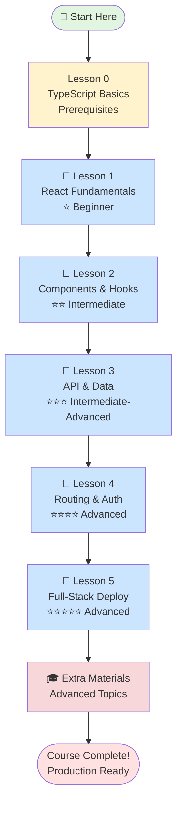
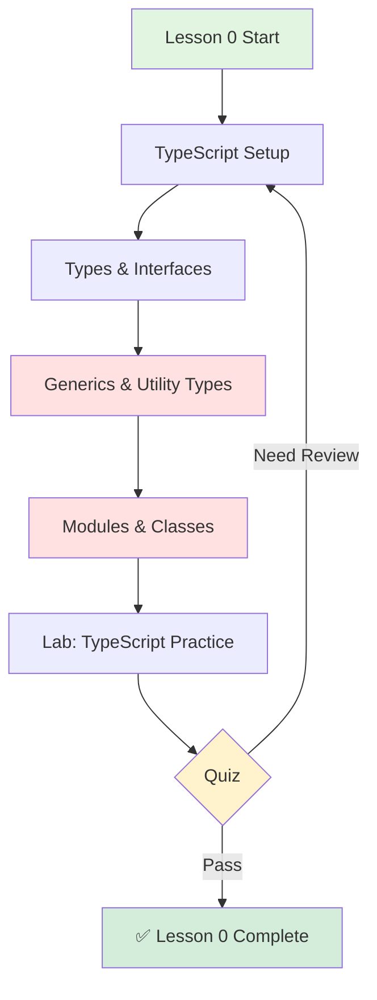
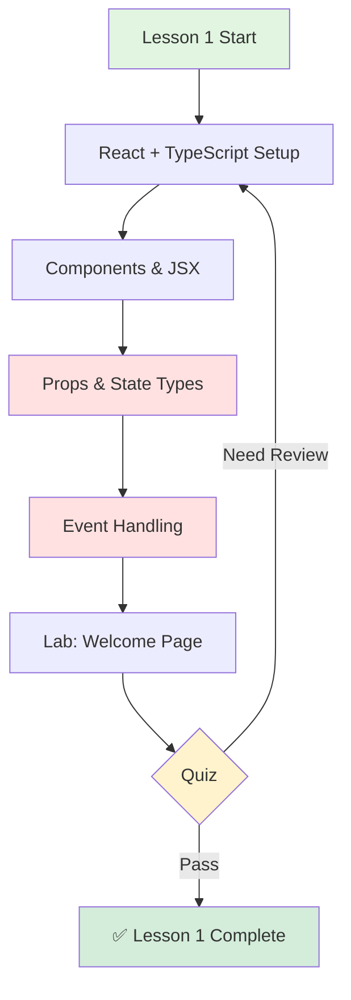
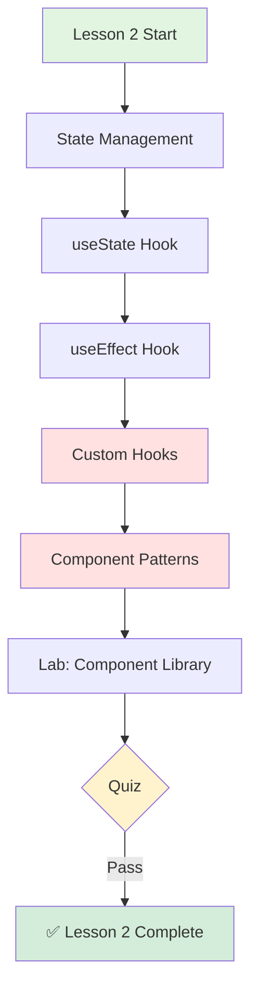
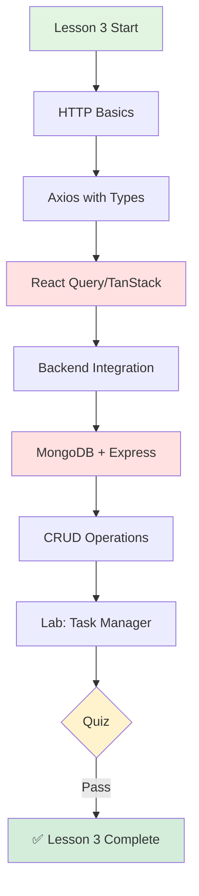
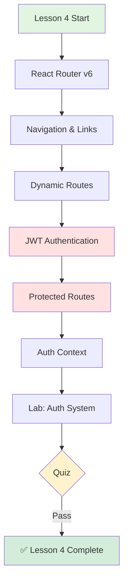
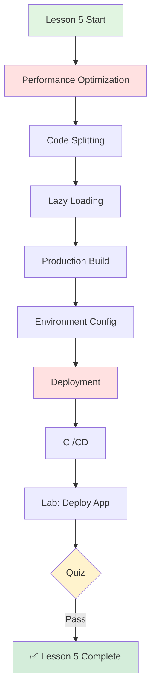
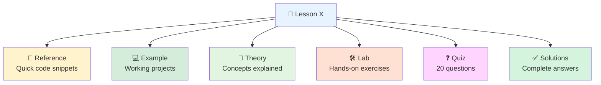

# 🗺️ React Course Learning Roadmap (TypeScript)

---

## Visual Learning Path

---

## TypeScript Learning Path

### 🎯 Lesson 0: TypeScript Basics (Foundation)
**Difficulty**: ⭐ Beginner
**Time**: 2-3 days
**Requires**: HTML, CSS, Basic JavaScript

**Key Topics**:
- TypeScript fundamentals
- Type annotations and inference
- Interfaces and type aliases
- Generics and utility types
- Modules and namespaces
- Classes and inheritance
- Strict type checking

**TypeScript Features**:
- Static type checking
- Interface definitions
- Generic programming
- Advanced type system
- Compile-time error detection
- IntelliSense support

**Lab Project**: TypeScript Practice Exercises

---

### 📘 Lesson 1: React Fundamentals with TypeScript
**Difficulty**: ⭐ Beginner
**Time**: 1 week
**Requires**: Lesson 0

**Key Topics**:
- JSX with TypeScript
- Typed functional components
- Props and state typing
- Event handling with types
- Virtual DOM concepts
- Vite setup with TypeScript

**TypeScript Features**:
- Component type definitions
- Props interface design
- State type management
- Event type handling
- Generic components

**Lab Project**: Welcome Page Application (TypeScript)

---

### 📘 Lesson 2: Components & Hooks
**Difficulty**: ⭐⭐ Intermediate
**Time**: 1-2 weeks
**Requires**: Lesson 1

**Key Topics**:
- useState with TypeScript
- useEffect for side effects
- useRef and useContext
- Custom hooks with types
- Component composition patterns
- Higher-Order Components (HOC)
- Render props pattern

**TypeScript Features**:
- Hook type definitions
- Custom hook typing
- Component pattern types
- Context type safety
- Ref type management

**Lab Project**: Reusable Component Library (TypeScript)

---

### 📘 Lesson 3: API Integration & Data
**Difficulty**: ⭐⭐⭐ Intermediate-Advanced
**Time**: 2 weeks
**Requires**: Lessons 1-2

**Key Topics**:
- REST API with TypeScript
- HTTP methods and responses
- React Query for data fetching
- Loading and error states
- Backend with Express + TypeScript
- MongoDB with Mongoose
- CORS configuration

**TypeScript Features**:
- API type definitions
- Data fetching types
- Error handling types
- Backend type safety
- Database schema types

**Lab Project**: Full-Stack Task Manager (TypeScript)

---

### 📘 Lesson 4: Routing & Authentication
**Difficulty**: ⭐⭐⭐⭐ Advanced
**Time**: 2 weeks
**Requires**: Lessons 1-3

**Key Topics**:
- React Router v6 with TypeScript
- Navigation and routing
- URL parameters and query strings
- JWT authentication
- Login/Register forms
- Protected routes
- Auth context management

**TypeScript Features**:
- Route type definitions
- Authentication types
- Context type safety
- Form validation types
- Route protection types

**Lab Project**: Authentication System (TypeScript)

---

### 📘 Lesson 5: Full-Stack & Deployment
**Difficulty**: ⭐⭐⭐⭐⭐ Advanced
**Time**: 2-3 weeks
**Requires**: Lessons 1-4

**Key Topics**:
- Performance optimization
- React.memo, useMemo, useCallback
- Code splitting with lazy loading
- Production builds
- Environment variables
- Deployment (Vercel, Netlify, Railway)
- Docker configuration
- CI/CD with GitHub Actions

**TypeScript Features**:
- Performance type optimization
- Build type checking
- Deployment type safety
- Environment type management
- CI/CD type workflows

**Lab Project**: Production Deployment (TypeScript)

---

## 📚 Component Structure

---