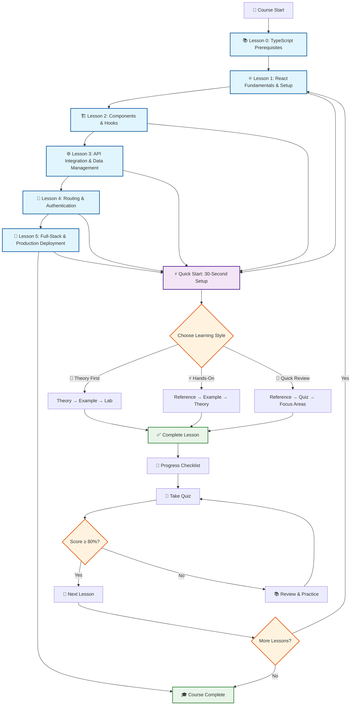
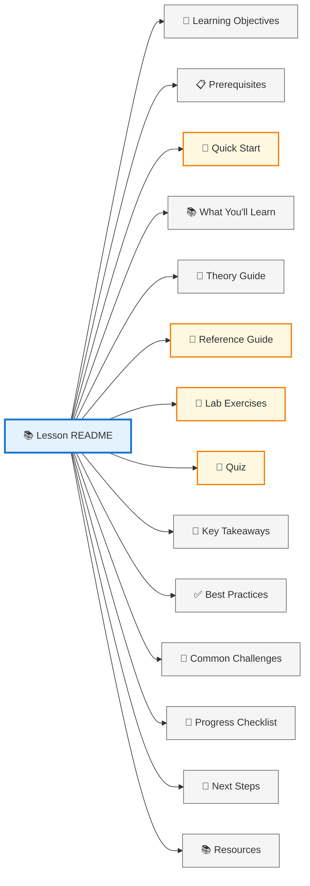
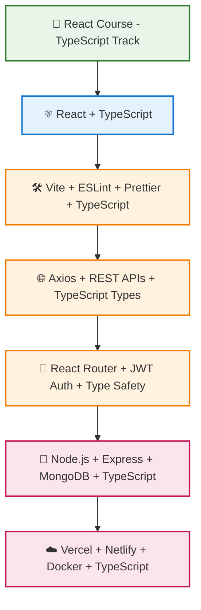
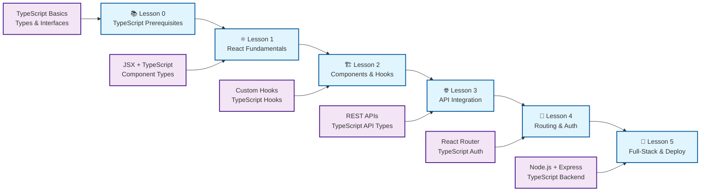
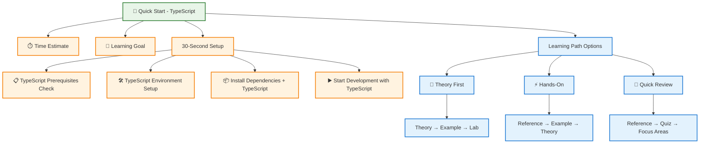
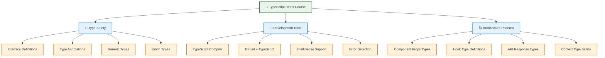

# React Course Structure Diagram (TypeScript)

## Course Learning Path

## Lesson Structure Template

## TypeScript Technology Stack

## Learning Objectives Progression

## Quick Start Flow

## TypeScript-Specific Features

## Visual Elements Legend

- 🎯 **Learning Objectives** - Clear goals for each lesson
- 📋 **Prerequisites** - Required TypeScript knowledge and setup
- 🚀 **Quick Start** - Fast TypeScript setup and learning paths
- 📚 **What You'll Learn** - Detailed TypeScript curriculum breakdown
- ⚛️ **React Components** - TypeScript component architecture and patterns
- 🎣 **Hooks** - TypeScript state management and side effects
- 🌐 **API Integration** - TypeScript backend communication
- 🔐 **Authentication** - TypeScript security and user management
- 🚀 **Deployment** - TypeScript production and scaling
- ✅ **Best Practices** - TypeScript professional development standards
- 🚨 **Common Challenges** - TypeScript troubleshooting and solutions
- 📝 **Progress Tracking** - TypeScript checklists and assessments
- 🧪 **Quizzes** - TypeScript knowledge validation
- 📖 **Resources** - Additional TypeScript learning materials