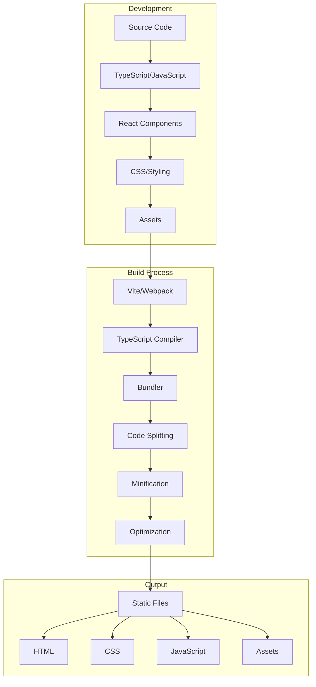
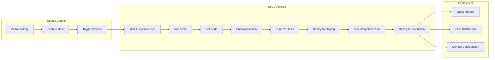
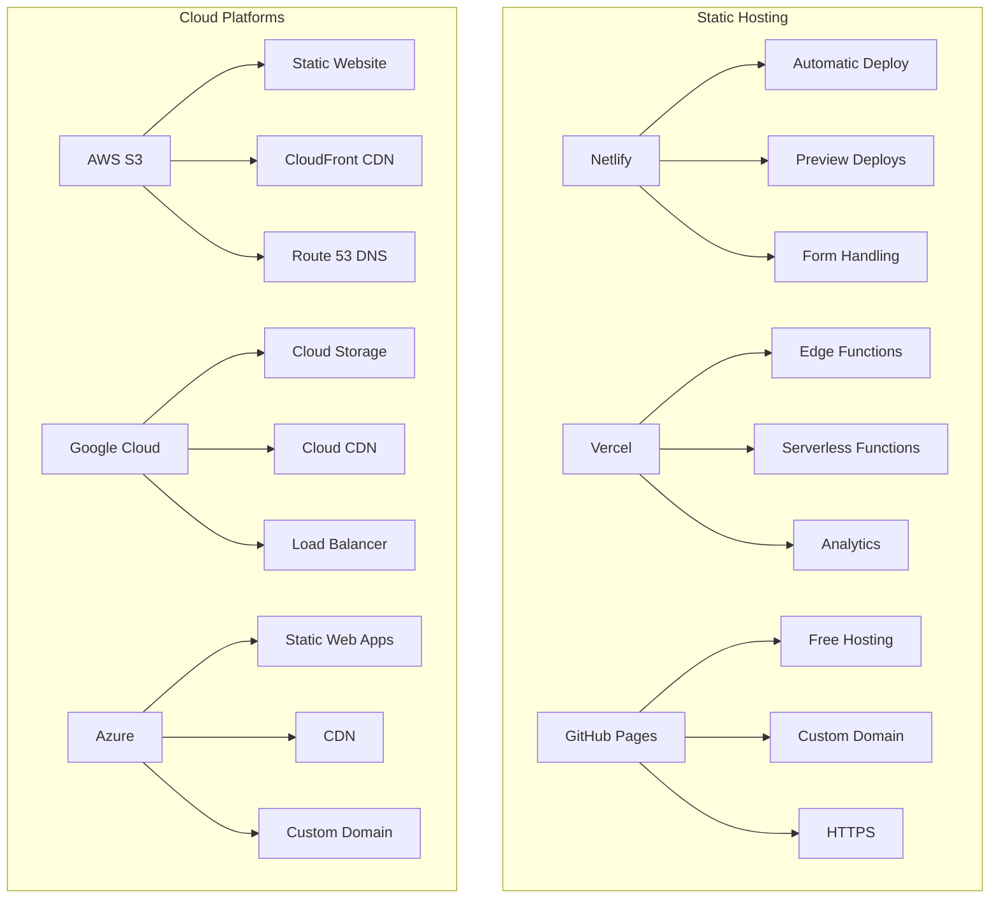
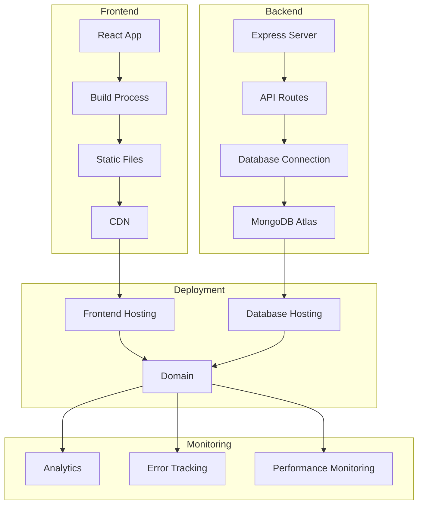
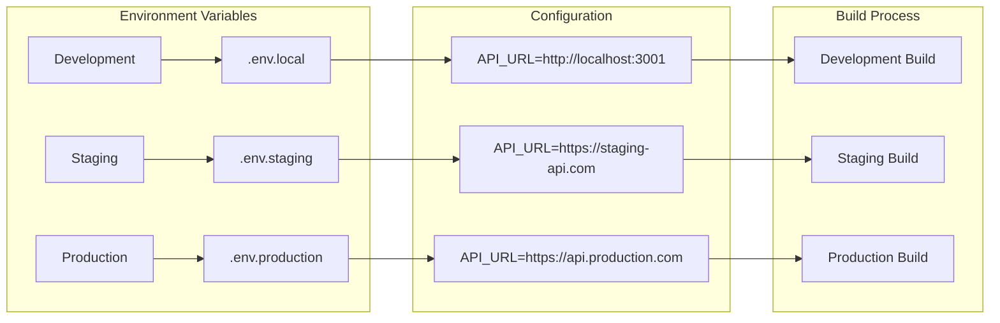
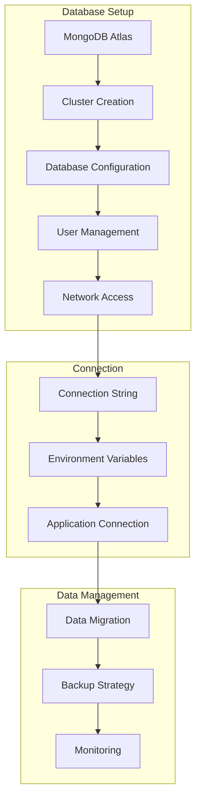
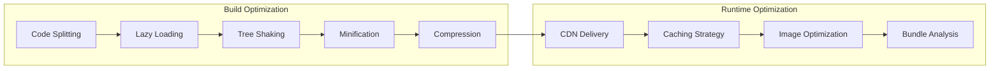
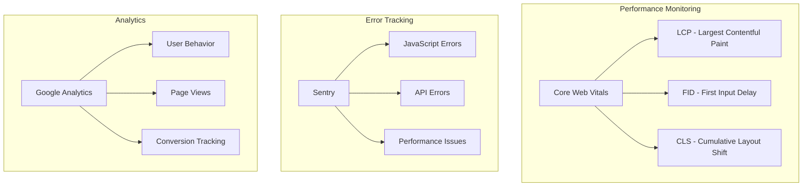

# Deployment Flow Diagram

## Overview

This diagram illustrates the complete deployment process from development to production, including build process, CI/CD pipeline, and deployment strategies.

## Build Process Flow



## CI/CD Pipeline



## Deployment Strategies



## Full-Stack Deployment



## Environment Configuration



## Database Deployment



## Performance Optimization



## Monitoring & Analytics



## Security Considerations

```mermaid
graph TB
    subgraph "Frontend Security"
        A[HTTPS] --> B[Secure Headers]
        B --> C[Content Security Policy]
        C --> D[XSS Protection]
    end
    
    subgraph "Backend Security"
        E[CORS Configuration] --> F[Rate Limiting]
        F --> G[Input Validation]
        G --> H[Authentication]
    end
    
    subgraph "Database Security"
        I[Connection Encryption] --> J[Access Control]
        J --> K[Data Encryption]
        K --> L[Backup Security]
    end
```



## Key Concepts

### 1.

**Build Process**
- TypeScript compilation
- Module bundling
- Asset optimization
- Code splitting

### 2. ** Deployment Strategies**
- Static hosting
- CDN distribution
- Environment configuration
- Domain management

### 3. ** CI/CD Pipeline**
- Automated testing
- Code quality checks
- Build automation
- Deployment automation

### 4. ** Performance Optimization**
- Bundle optimization
- Caching strategies
- Image optimization
- Core Web Vitals

## Best Practices

### Environment Configuration
```typescript
// Environment variables
const config = {
  apiUrl: process.env.REACT_APP_API_URL || 'http://localhost:3001',
  environment: process.env.NODE_ENV || 'development',
  version: process.env.REACT_APP_VERSION || '1.0.0'
};
```

### Build Optimization
```typescript
// Vite configuration
export default defineConfig({
  build: {
    rollupOptions: {
      output: {
        manualChunks: {
          vendor: ['react', 'react-dom'],
          router: ['react-router-dom'],
          ui: ['@mui/material', '@mui/icons-material']
        }
      }
    }
  }
});
```

### Deployment Configuration
```yaml
# GitHub Actions workflow
name: Deploy
on:
  push:
    branches: [main]
jobs:
  deploy:
    runs-on: ubuntu-latest
    steps:
      - uses: actions/checkout@v2
      - name: Setup Node.js
        uses: actions/setup-node@v2
        with:
          node-version: '18'
      - name: Install dependencies
        run: npm install
      - name: Build
        run: npm run build
      - name: Deploy
        run: npm run deploy
```

## Related Diagrams

- [Project Architecture](./PROJECT_ARCHITECTURE.md) - Full-stack architecture
- [API Data Flow](./API_DATA_FLOW.md) - API integration flow
- [Authentication Flow](./AUTHENTICATION_FLOW.md) - User authentication
