# Full-Stack Project Architecture Diagrams

## 1. Complete Full-Stack Architecture Overview

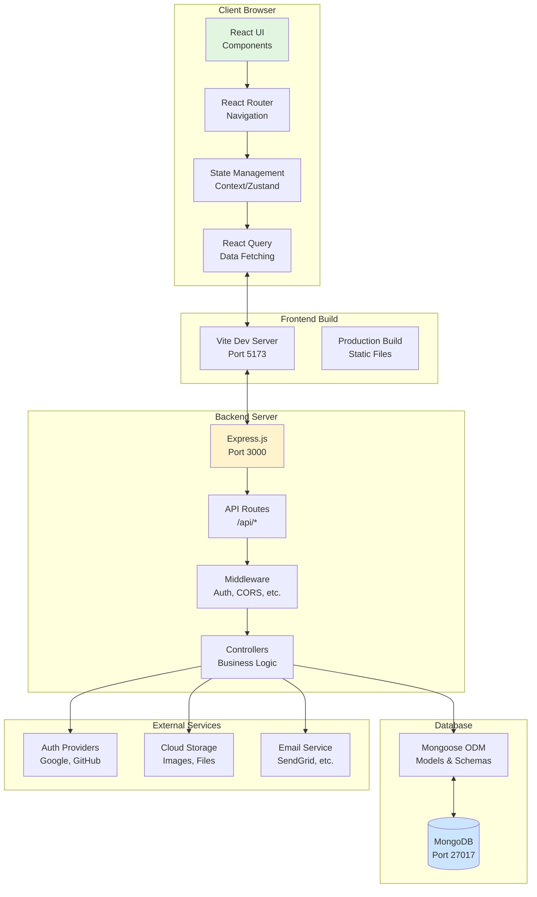

---

## 2. Development Environment Architecture

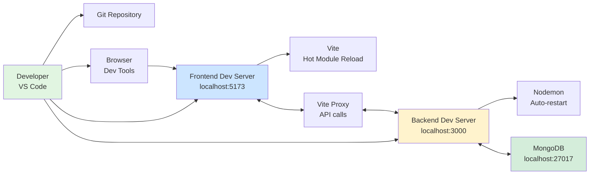

**vite.config.ts**
```typescript
export default defineConfig({
  server: {
    port: 5173,
    proxy: {
      '/api': {
        target: 'http://localhost:3000',
        changeOrigin: true,
      },
    },
  },
});
```

---

## 3. Folder Structure Architecture

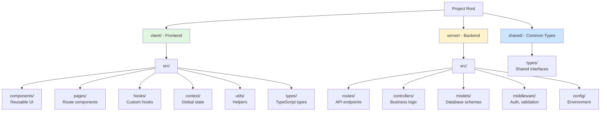

---

## 4. HTTP Request Flow (Detailed)

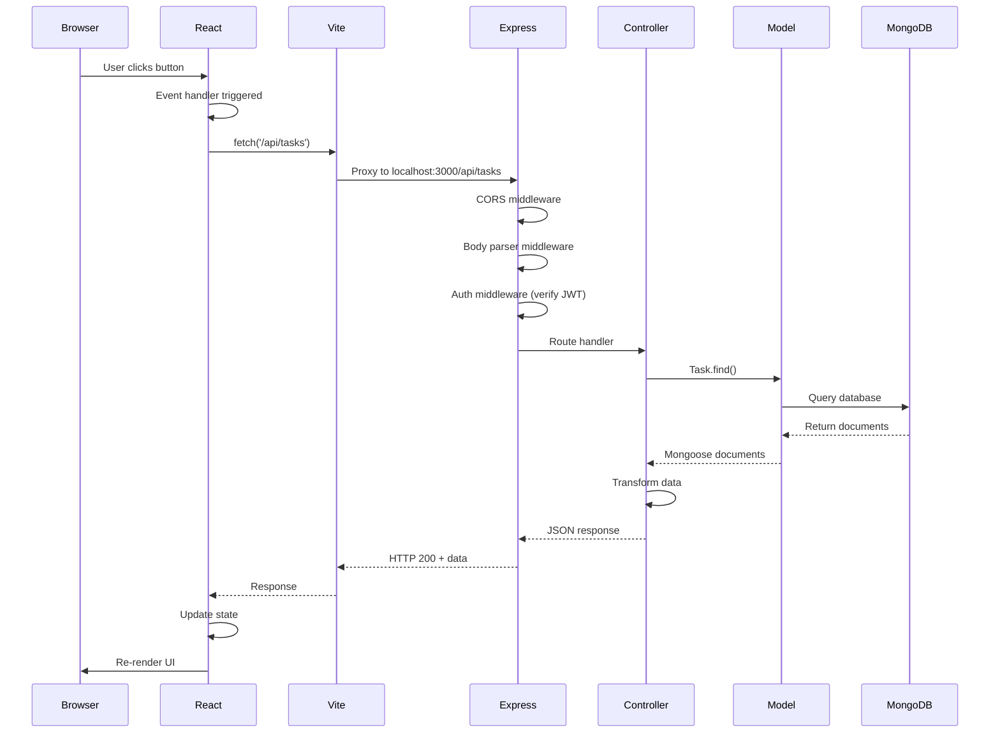

---

## 5. Database Schema Architecture (Task Manager Example)

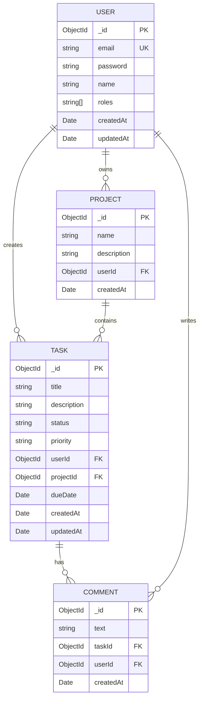

**Mongoose Models**
```typescript
// User Model
const userSchema = new Schema({
  email: { type: String, required: true, unique: true },
  password: { type: String, required: true },
  name: { type: String, required: true },
  roles: { type: [String], default: ['user'] },
}, { timestamps: true });

// Task Model
const taskSchema = new Schema({
  title: { type: String, required: true },
  description: String,
  status: { type: String, enum: ['todo', 'in-progress', 'done'], default: 'todo' },
  priority: { type: String, enum: ['low', 'medium', 'high'], default: 'medium' },
  userId: { type: Schema.Types.ObjectId, ref: 'User', required: true },
  projectId: { type: Schema.Types.ObjectId, ref: 'Project' },
  dueDate: Date,
}, { timestamps: true });
```

---

## 6. Component-to-Database Data Flow

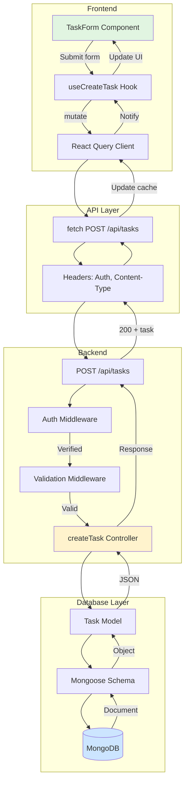

---

## 7. Authentication Integration Architecture

```mermaid
graph TD
    subgraph Frontend Auth
        LoginForm[Login Form]
        AuthContext[Auth Context Provider]
        ProtectedRoute[Protected Route Wrapper]
        useAuth[useAuth Hook]
    end

    subgraph API Calls
        AuthAPI[Auth API Functions]
        Interceptor[Request Interceptor<br/>Add JWT token]
    end

    subgraph Backend Auth
        AuthRoutes[/api/auth Routes]
        AuthController[Auth Controller]
        JWT[JWT Service]
        PassHash[Password Hashing]
    end

    subgraph Database
        UserModel[User Model]
        MongoDB[(MongoDB)]
    end

    LoginForm --> AuthContext
    AuthContext --> useAuth
    useAuth --> ProtectedRoute

    AuthContext --> AuthAPI
    AuthAPI --> Interceptor
    Interceptor --> AuthRoutes

    AuthRoutes --> AuthController
    AuthController --> JWT
    AuthController --> PassHash
    AuthController --> UserModel
    UserModel --> MongoDB

    JWT -.Token.-> Interceptor

    style AuthContext fill:#e1f5e1
    style AuthController fill:#fff3cd
    style MongoDB fill:#cce5ff
```

---

## 8. Error Handling Architecture

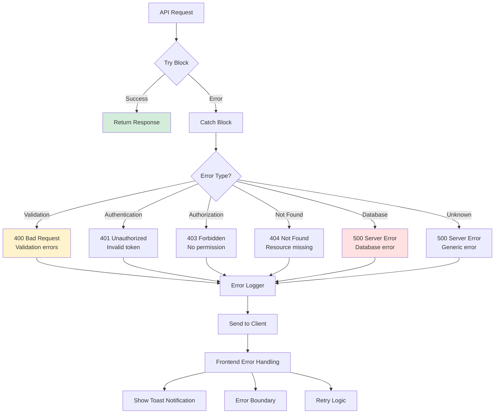

**Backend Error Handler**
```typescript
// Global error handler middleware
app.use((err: Error, req: Request, res: Response, next: NextFunction) => {
  console.error('Error:', err);

  if (err.name === 'ValidationError') {
    return res.status(400).json({ message: err.message, errors: err });
  }

  if (err.name === 'UnauthorizedError') {
    return res.status(401).json({ message: 'Invalid token' });
  }

  if (err.name === 'CastError') {
    return res.status(404).json({ message: 'Resource not found' });
  }

  res.status(500).json({
    message: 'Internal server error',
    ...(process.env.NODE_ENV === 'development' && { stack: err.stack })
  });
});
```

---

## 9. Production Deployment Architecture

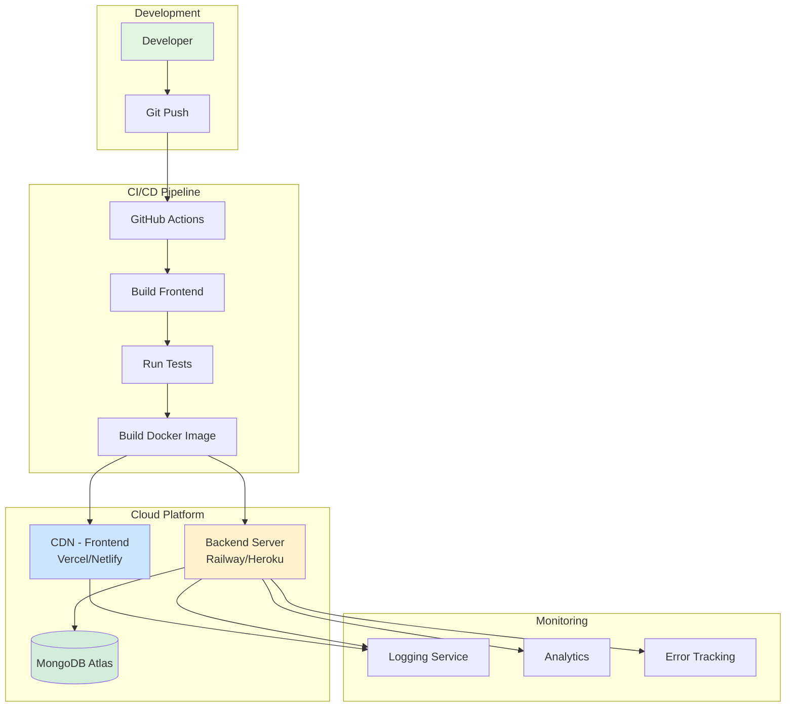

---

## 10. Environment Configuration Flow

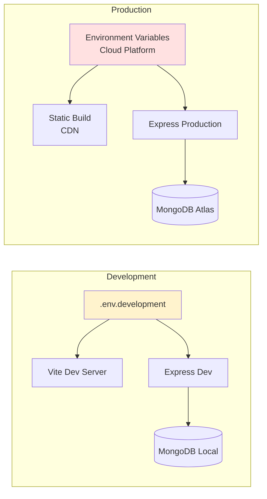

**Environment Variables**
```bash
# Frontend (.env)
VITE_API_URL=http://localhost:3000
VITE_GOOGLE_CLIENT_ID=xxx

# Backend (.env)
NODE_ENV=development
PORT=3000
MONGODB_URI=mongodb://localhost:27017/taskmanager
JWT_SECRET=your-secret-key
CORS_ORIGIN=http://localhost:5173
```

---

## 11. State Management Integration

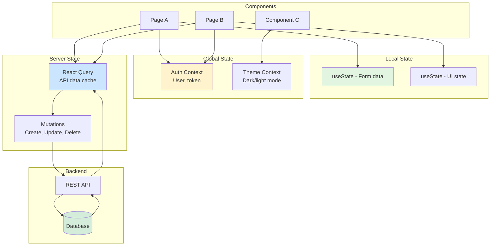

---

## 12. Real-time Features Architecture (WebSocket)

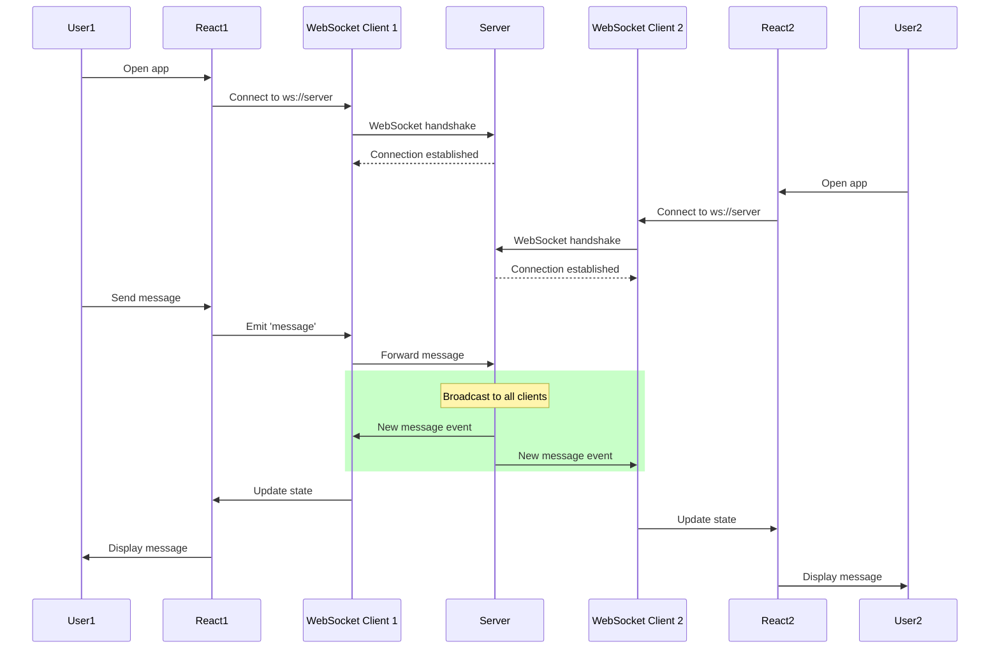

---

## 13. Caching Strategy Architecture

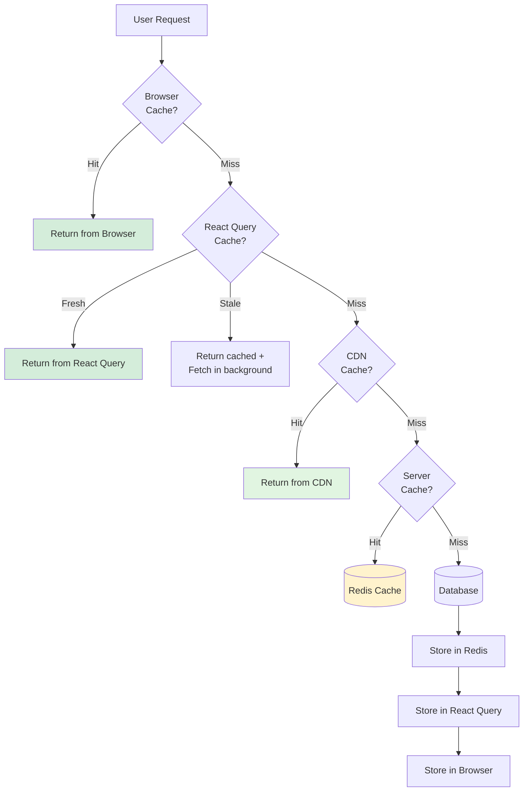

---

## 14. Security Layers

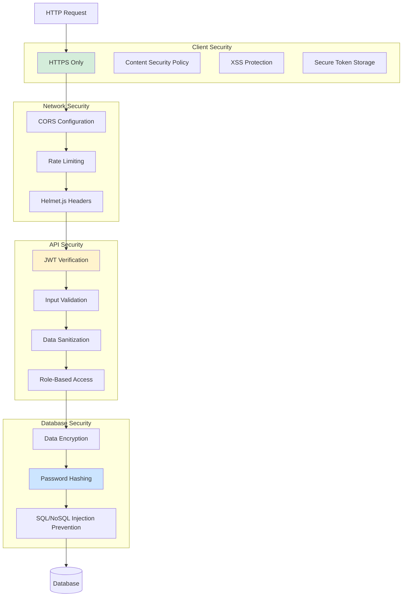

---
