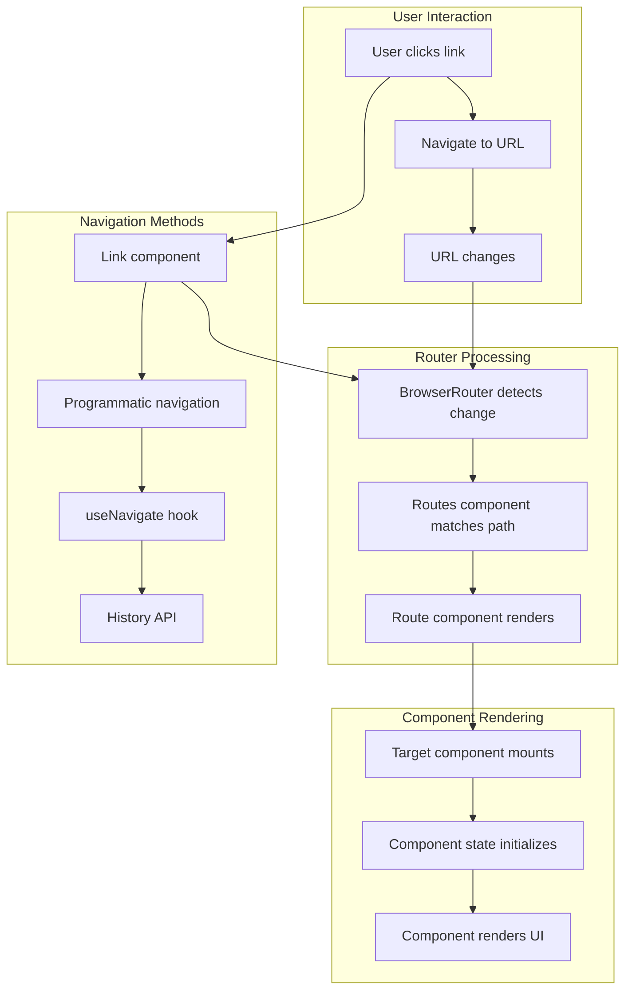
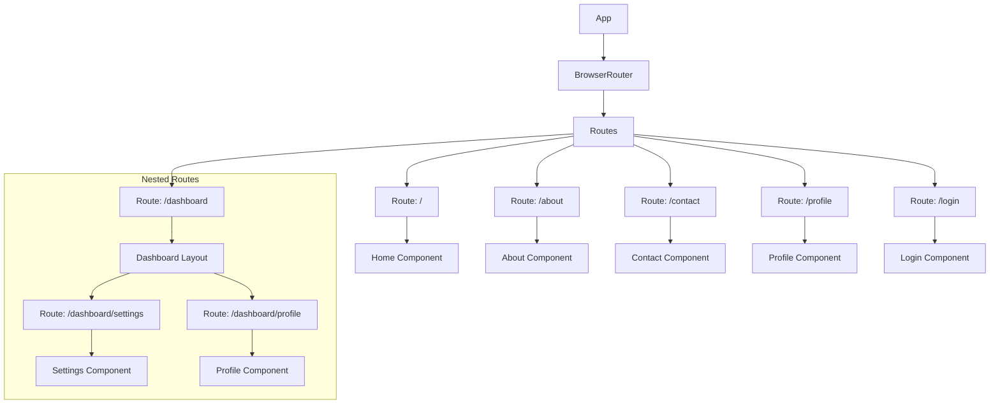
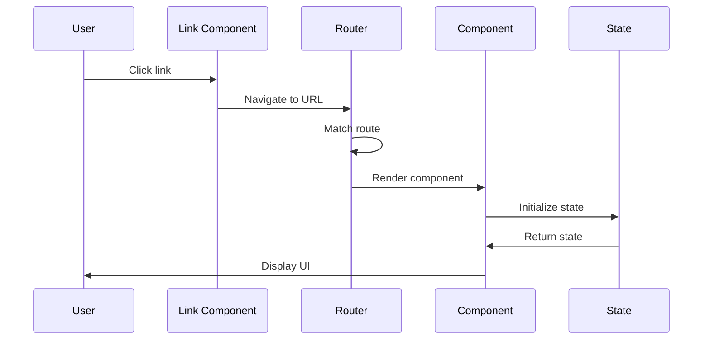
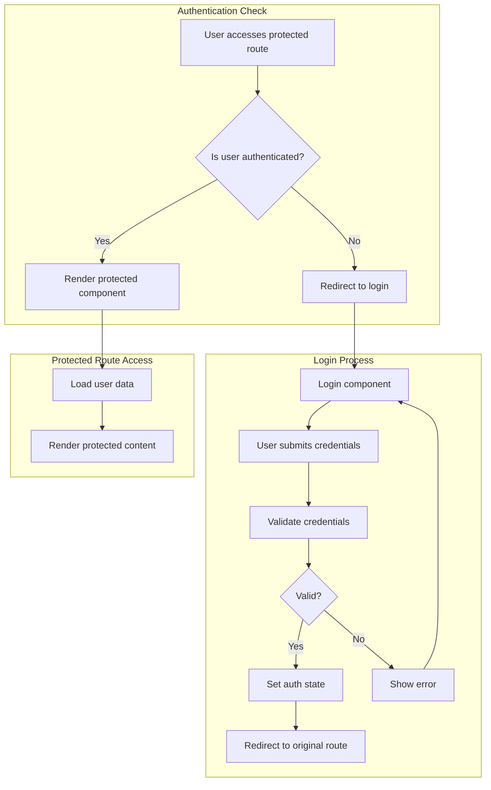
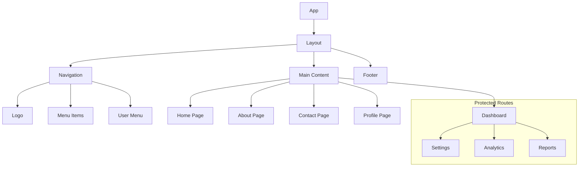
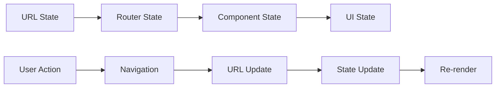

# React Router Flow Diagram

## Overview

This diagram illustrates how React Router handles navigation and routing in a React application, showing the flow from user interaction to component rendering.

## Router Flow



## Route Structure



## Navigation Flow



## Route Protection Flow



## URL Structure

### Basic Routes
```
/                    # Home page
/about              # About page
/contact            # Contact page
/profile            # User profile
/login              # Login page
```

### Nested Routes
```
/dashboard          # Dashboard layout
├── /dashboard/settings    # Settings page
├── /dashboard/profile     # Profile page
└── /dashboard/analytics   # Analytics page
```

### Dynamic Routes
```
/users/:id          # User detail page
/posts/:slug        # Blog post page
/products/:category # Product category page
```

### Query Parameters
```
/search?q=react&category=tutorial
/filter?price=100&brand=nike
```

## Component Hierarchy



## State Management



## Key Concepts

### 1. **Declarative Routing**
- Routes defined as components
- URL-based navigation
- Automatic re-rendering on route change

### 2. **Nested Routing**
- Parent-child route relationships
- Layout components
- Nested navigation

### 3. **Route Protection**
- Authentication guards
- Role-based access
- Redirect handling

### 4. **Dynamic Routing**
- URL parameters
- Query strings
- Programmatic navigation

## Best Practices

### Route Organization
```typescript
// Route structure
<Routes>
  <Route path="/" element={<Home />} />
  <Route path="/about" element={<About />} />
  <Route path="/contact" element={<Contact />} />
  <Route path="/login" element={<Login />} />
  <Route path="/profile" element={
    <ProtectedRoute>
      <Profile />
    </ProtectedRoute>
  } />
  <Route path="/dashboard" element={
    <ProtectedRoute>
      <Dashboard />
    </ProtectedRoute>
  } />
</Routes>
```

### Navigation Components
```typescript
// Link component
<Link to="/about">About</Link>

// Programmatic navigation
const navigate = useNavigate();
navigate('/profile');

// With state
navigate('/profile', { state: { from: 'home' } });
```

### Route Parameters
```typescript
// Access route parameters
const { id } = useParams();

// Access query parameters
const [searchParams] = useSearchParams();
const query = searchParams.get('q');
```

## Related Diagrams

- [Authentication Flow](./AUTHENTICATION_FLOW.md) - User authentication process
- [State Management Flow](./STATE_MANAGEMENT_FLOW.md) - Application state management
- [Component Lifecycle](./COMPONENT_LIFECYCLE.md) - Component behavior
