# State Management Flow Diagrams

## 1. State Management Levels Overview


---

## 2. Local State Flow (useState)


---

## 3. Lifted State (Props Drilling)


** Problems**
- 🔴 Props drilling through multiple levels
- 🔴 All intermediate components need props
- 🔴 Difficult to maintain

---

## 4. Context API Flow

```mermaid
graph TD
    Provider[Context Provider<br/>Wraps entire app<br/>Value: state + updaters] --> Tree[Component Tree]

    Tree --> Comp1[Component A<br/>✅ useContext]
    Tree --> Comp2[Component B<br/>❌ No context]
    Tree --> Comp3[Component C<br/>✅ useContext]

    Comp1 --> Access1[Direct access to context]
    Comp3 --> Access3[Direct access to context]

    Comp1 -.Update Context.-> Provider
    Comp3 -.Update Context.-> Provider

    Provider -.Re-render.-> Comp1
    Provider -.Re-render.-> Comp3

    style Provider fill:#e1f5e1
    style Comp1 fill:#d4edda
    style Comp2 fill:#f0f0f0
    style Comp3 fill:#d4edda
```




---

## 5. Context API vs Props Drilling Comparison


---

## 6. Multiple Contexts Pattern


---

## 7. useReducer State Flow


---

## 8. Zustand State Flow (External Library)


** Code Example**
```typescript
// 1. Create Store (outside component)
const useStore = create<StoreState>((set) => ({
  count: 0,
  increment: () => set((state) => ({ count: state.count + 1 })),
  decrement: () => set((state) => ({ count: state.count - 1 })),
}));

// 2. Use in any component
function Counter() {
  const { count, increment } = useStore();
  return <button onClick={increment}>Count: {count}</button>;
}

function Display() {
  const count = useStore((state) => state.count); // Selective subscription
  return <p>{count}</p>;
}
```

** Benefits**
- ✅ No Provider needed
- ✅ Minimal boilerplate
- ✅ Selective subscriptions (performance)

---

## 9. Redux Toolkit Flow


** Code Example**
```typescript
// 1. Create Slice
const counterSlice = createSlice({
  name: 'counter',
  initialState: { value: 0 },
  reducers: {
    increment: (state) => { state.value += 1; },
    decrement: (state) => { state.value -= 1; },
  },
});

// 2. Configure Store
const store = configureStore({
  reducer: { counter: counterSlice.reducer },
});

// 3. Use in Component
function Counter() {
  const count = useSelector((state) => state.counter.value);
  const dispatch = useDispatch();

  return (
    <button onClick={() => dispatch(counterSlice.actions.increment())}>
      Count: {count}
    </button>
  );
}

// 4. Provider
<Provider store={store}>
  <App />
</Provider>
```

---

## 10. State Management Decision Tree


---

## 11. State Update Patterns Comparison

```mermaid
graph LR
    subgraph Direct Mutation BAD
        A1[state.count = 5] --> A2[❌ Does not trigger re-render]
    end

    subgraph Immutable Update GOOD
        B1[setState count: 5] --> B2[✅ Triggers re-render]
    end

    subgraph Object Update BAD
        C1[state.user.name = 'Bob'] --> C2[❌ Mutates object]
    end

    subgraph Object Update GOOD
        D1[setState ...state,<br/>user: ...user, name: 'Bob'] --> D2[✅ New object reference]
    end

    style A1 fill:#ffe1e1
    style A2 fill:#ffe1e1
    style C1 fill:#ffe1e1
    style C2 fill:#ffe1e1
    style B1 fill:#d4edda
    style B2 fill:#d4edda
    style D1 fill:#d4edda
    style D2 fill:#d4edda
```



** Example**

❌ ** Wrong** (Mutation):
```typescript
const [user, setUser] = useState({ name: 'Alice', age: 25 });

// DON'T DO THIS
user.name = 'Bob'; // Mutation!
setUser(user); // Same reference, may not re-render
```

✅ ** Correct** (Immutable):
```typescript
const [user, setUser] = useState({ name: 'Alice', age: 25 });

// DO THIS
setUser({ ...user, name: 'Bob' }); // New object
```

---

## 12. Async State Updates (API Calls)


** Code Example**
```typescript
function DataFetcher() {
  const [data, setData] = useState(null);
  const [loading, setLoading] = useState(false);
  const [error, setError] = useState(null);

  const fetchData = async () => {
    setLoading(true);
    setError(null);

    try {
      const response = await fetch('/api/data');
      const json = await response.json();
      setData(json);
    } catch (err) {
      setError(err.message);
    } finally {
      setLoading(false);
    }
  };

  if (loading) return <Spinner />;
  if (error) return <Error message={error} />;
  return <DataDisplay data={data} />;
}
```

---

## 13. State Synchronization Across Tabs


** Code Example**
```typescript
function useSyncedState(key: string, initialValue: any) {
  const [state, setState] = useState(() => {
    const stored = localStorage.getItem(key);
    return stored ? JSON.parse(stored) : initialValue;
  });

  useEffect(() => {
    localStorage.setItem(key, JSON.stringify(state));
  }, [key, state]);

  useEffect(() => {
    const handleStorage = (e: StorageEvent) => {
      if (e.key === key && e.newValue) {
        setState(JSON.parse(e.newValue));
      }
    };

    window.addEventListener('storage', handleStorage);
    return () => window.removeEventListener('storage', handleStorage);
  }, [key]);

  return [state, setState];
}
```

---

## 14. State Performance Optimization


** Code Example**
```typescript
// Without memo: re-renders on every parent update
function ChildA({ name }) {
  return <p>{name}</p>;
}

// With memo: re-renders only when props change
const ChildB = React.memo(({ name }) => {
  return <p>{name}</p>;
});

// With memo + useMemo: optimized computed values
const ChildC = React.memo(({ items }) => {
  const total = useMemo(() => {
    return items.reduce((sum, item) => sum + item.price, 0);
  }, [items]); // Only recompute when items change

  return <p>Total: {total}</p>;
});
```

---

** Created** October 6, 2025
** For** React Course - LongNDT **Topic** State Management **Related Lessons** Lesson 2, Lesson 3
** Extra Material** [State Management Guide](../extras/state_management.md)
