# 🗺️ React Course Learning Roadmap (JavaScript)

---

## Visual Learning Path

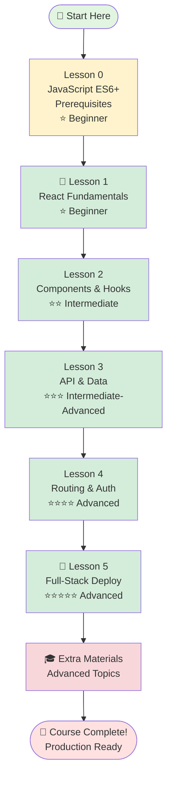

---

## JavaScript Learning Path

### 🎯 Lesson 0: JavaScript ES6+ Essentials (Foundation)
**Difficulty**: ⭐ Beginner
**Time**: 2-3 days
**Type**: JavaScript Prerequisites

**What You'll Learn**:
- Modern JavaScript ES6+ features
- Arrow functions and template literals
- Destructuring and spread operator
- Promises and async/await
- Modules (import/export)
- Array methods (map, filter, reduce)

**Prerequisites**: HTML, CSS, Basic JavaScript

---

### � Lesson 1: React Fundamentals with JavaScript
**Difficulty**: ⭐ Beginner
**Time**: 1 week
**Components**: 6 (Reference, Example, Theory, Lab, Quiz, Solutions)

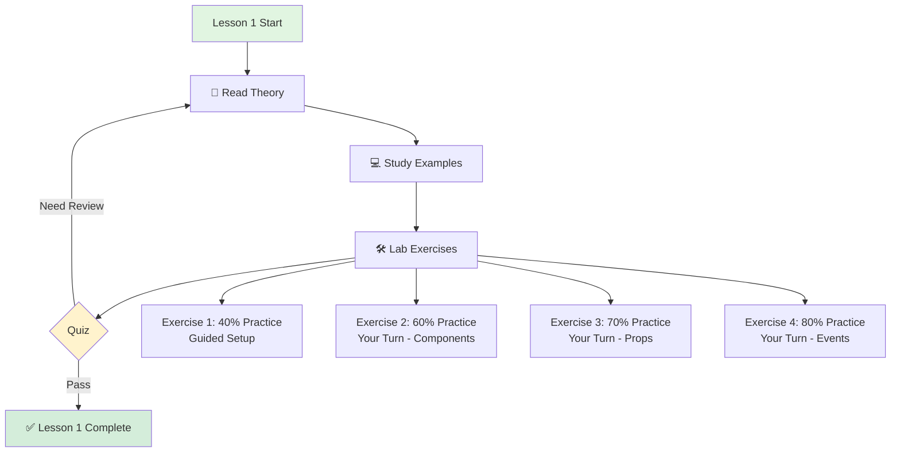

**Key Topics**:
- JSX syntax and dynamic expressions
- Functional components
- Props and PropTypes validation
- Event handling with arrow functions
- Virtual DOM concepts
- Vite setup and tooling

**JavaScript Features**:
- Dynamic prop validation with PropTypes
- Flexible component patterns
- Object destructuring in props
- Template literals in JSX
- Spread operators for props

**Lab Project**: Welcome Page Application (JavaScript)

---

### � Lesson 2: Components & Hooks
**Difficulty**: ⭐⭐ Intermediate
**Time**: 1-2 weeks
**Requires**: Lesson 1

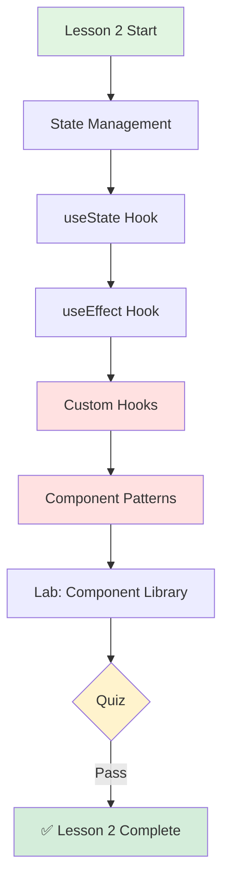

**Key Topics**:
- useState for flexible state management
- useEffect for side effects and lifecycle
- useRef and useContext
- Custom hooks creation
- Component composition patterns
- Higher-Order Components (HOCs)
- Render props pattern

**JavaScript Features**:
- Dynamic state updates
- Flexible custom hooks without type constraints
- Object and array state handling
- Closure patterns in hooks
- Callback functions in state setters

**Lab Project**: Reusable Component Library (JavaScript)

---

### � Lesson 3: API Integration & Data
**Difficulty**: ⭐⭐⭐ Intermediate-Advanced
**Time**: 2 weeks
**Requires**: Lessons 1-2

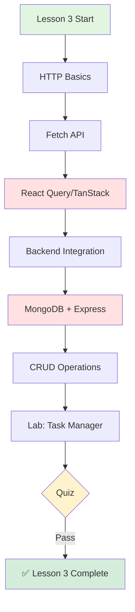

**Key Topics**:
- REST API concepts with JavaScript
- HTTP methods (GET, POST, PUT, DELETE)
- React Query for flexible data fetching
- Loading and error states
- Backend with Express.js
- MongoDB with Mongoose
- CORS configuration

**JavaScript Features**:
- Dynamic API response handling
- Flexible data transformations
- Object manipulation without type constraints
- Async/await patterns
- Error handling with try/catch
- JSON parsing and stringification

**Lab Project**: Full-Stack Task Manager (JavaScript)

---

### � Lesson 4: Routing & Authentication
**Difficulty**: ⭐⭐⭐⭐ Advanced
**Time**: 2 weeks
**Requires**: Lessons 1-3

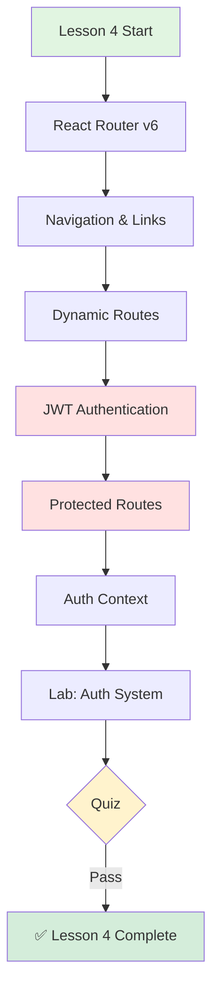

**Key Topics**:
- React Router v6 with JavaScript
- Route configuration
- Navigation and Links
- Dynamic URL parameters
- JWT token authentication
- Login/Register flows
- Protected routes with HOCs
- Auth context provider

**JavaScript Features**:
- Flexible route parameter handling
- Dynamic auth context patterns
- JWT payload decoding
- LocalStorage token management
- Conditional rendering for auth states
- Higher-Order Components for route protection

**Lab Project**: Authentication System (JavaScript)

---

### � Lesson 5: Full-Stack & Deployment
**Difficulty**: ⭐⭐⭐⭐⭐ Advanced
**Time**: 2-3 weeks
**Requires**: Lessons 1-4

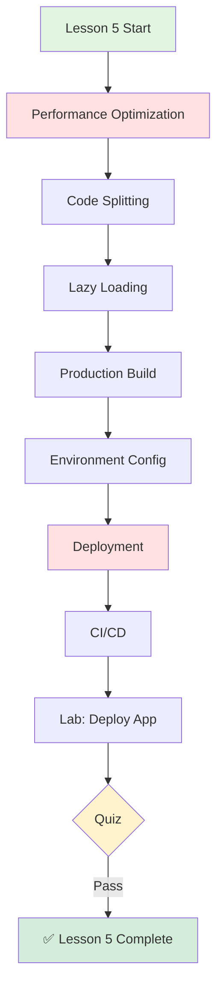

**Key Topics**:
- Performance optimization techniques
- React.memo, useMemo, useCallback
- Code splitting strategies
- Lazy loading components
- Production builds with Vite
- Environment variables (.env)
- Deployment (Vercel, Netlify, Railway)
- Docker basics
- CI/CD with GitHub Actions

**JavaScript Features**:
- Dynamic imports for code splitting
- Flexible environment configuration
- Runtime configuration without build-time types
- PropTypes in production warnings
- ESLint for code quality
- Babel/Vite optimizations

**Lab Project**: Production Deployment (JavaScript)

---

### 🎓 Extra Materials (Advanced Topics)

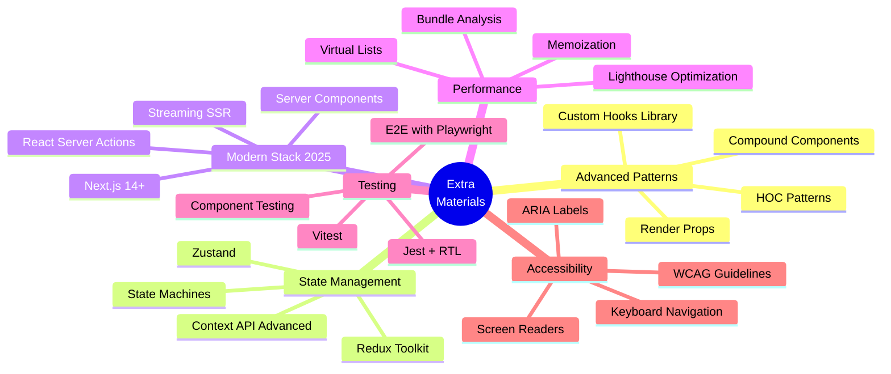

**Available Guides**:
- 📚 Advanced Patterns (892 lines)
- 📚 State Management (933 lines)
- 📚 Modern Stack 2025
- 📚 Performance Optimization
- 📚 Web Testing
- 📚 Web Accessibility
- 📚 Environment Setup (495 lines)
- 📚 Troubleshooting (1620 lines)

---

## 📊 Difficulty Progression

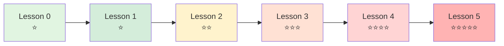

---

## 🎯 Practice Progression System

Each lab follows a progressive difficulty system:

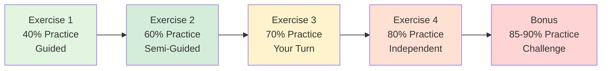

**What This Means**:
- **40% Practice**: Mostly guided with step-by-step instructions
- **60% Practice**: Some guidance, more independent work
- **70% Practice**: Concept review + mostly independent
- **80% Practice**: Minimal hints, figure it out yourself
- **85-90% Practice**: Challenge problems, no hints

---

## 🏆 Learning Outcomes Timeline

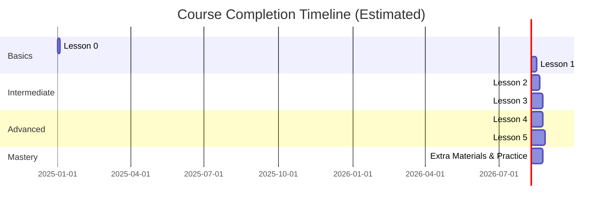

**Total Estimated Time**: 10-12 weeks (part-time study)

---

## 🚀 Quick Start Guide

### Option 1: TypeScript Track (Recommended)
```
1. Start with Lesson 0 (TypeScript)
2. Follow lessons 1 → 5 in TypeScript version
3. Complete all labs and quizzes
4. Explore extra materials
```

### Option 2: JavaScript Track
```
1. Start with Lesson 0 (JavaScript ES6+)
2. Follow lessons 1 → 5 in JavaScript version
3. Complete all labs and quizzes
4. Can switch to TypeScript anytime
```

### Option 3: Hybrid Approach
```
1. Learn both tracks in Lesson 0
2. Mix TypeScript and JavaScript lessons
3. Compare implementations
4. Build projects in both languages
```

---

## 📚 Component Structure (Every Lesson)

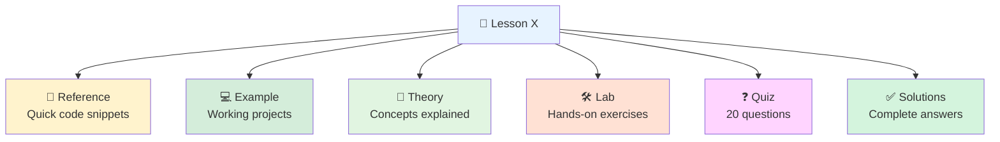

---

## 🎓 Completion Checklist

### Per Lesson
- [ ] Read theory document
- [ ] Study reference code
- [ ] Run example projects
- [ ] Complete all lab exercises
- [ ] Pass quiz (80%+ recommended)
- [ ] Review solutions
- [ ] Build your own variation

### Overall Course
- [ ] Complete all 6 lessons
- [ ] Build all lab projects
- [ ] Pass all quizzes
- [ ] Read extra materials
- [ ] Build 1 portfolio project
- [ ] Deploy to production
- [ ] Share your work

---

## 🆘 Support Resources

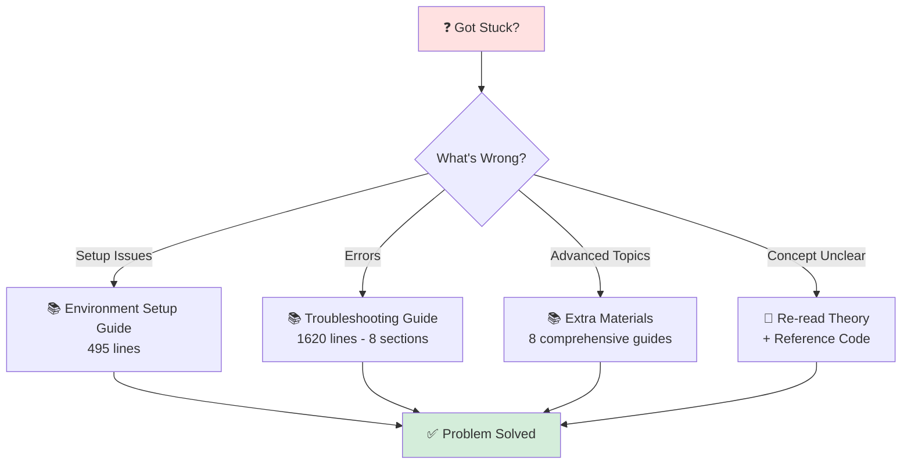

**Available Support**:
- 📚 Environment Setup (495 lines)
- 📚 Troubleshooting Guide (1620 lines)
- 📚 8 Extra Materials Guides
- 📚 Complete Solutions for All Labs
- 📚 Reference Code for Quick Lookup

---

## 🎯 Success Metrics

**You're ready to move to the next lesson when**:
- ✅ Completed all lab exercises
- ✅ Quiz score ≥ 80%
- ✅ Understand all concepts (can explain to others)
- ✅ Can code examples from memory
- ✅ Debugged common errors independently

**Course completion means**:
- ✅ Built 6+ React applications
- ✅ Comfortable with modern React patterns
- ✅ Can build full-stack applications
- ✅ Understand authentication & routing
- ✅ Deployed apps to production
- ✅ Ready for real-world projects

---

## 🚀 Next Steps After Course

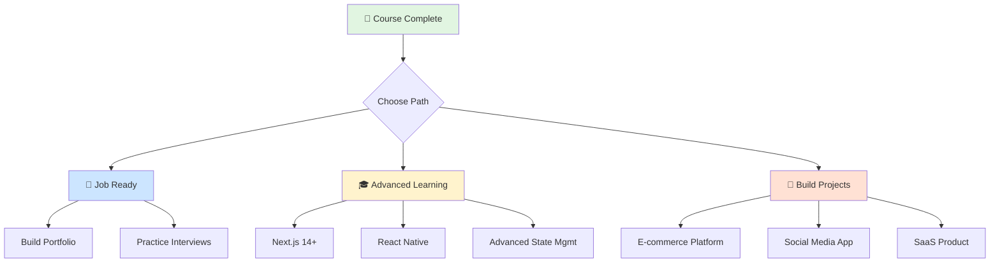

---

**Created**: October 6, 2025
**Course**: React Course - LongNDT
**Total Lessons**: 6 (0-5)
**Total Time**: 10-12 weeks
**Difficulty**: Beginner → Advanced
**Languages**: TypeScript & JavaScript

**Start Your Journey**: [Lesson 0 - Prerequisites](../lesson0-typescript/readme.md) 🚀
