# API Integration & Data Flow Diagrams

## 1. Complete API Request Lifecycle

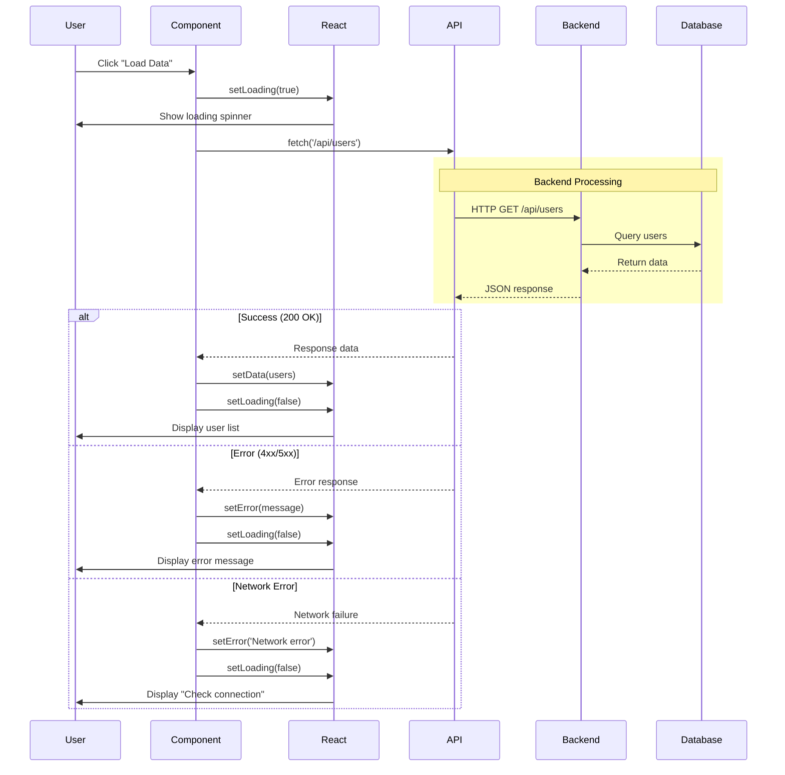

---

## 2. useState for Data Fetching Pattern

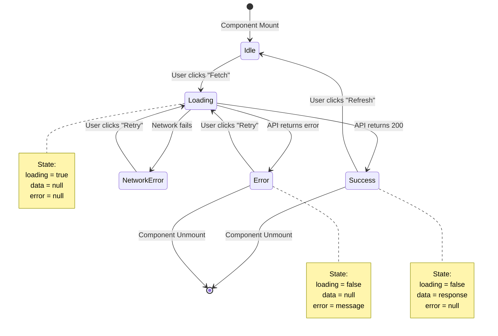

**Code Example**
```typescript
function UserList() {
  const [data, setData] = useState<User[]>([]);
  const [loading, setLoading] = useState(false);
  const [error, setError] = useState<string | null>(null);

  const fetchUsers = async () => {
    setLoading(true);
    setError(null);

    try {
      const response = await fetch('/api/users');
      if (!response.ok) throw new Error('Failed to fetch');
      const users = await response.json();
      setData(users);
    } catch (err) {
      setError(err instanceof Error ? err.message : 'Unknown error');
    } finally {
      setLoading(false);
    }
  };

  if (loading) return <Spinner />;
  if (error) return <Error message={error} />;
  return <UserGrid users={data} />;
}
```

---

## 3. React Query/TanStack Query Flow

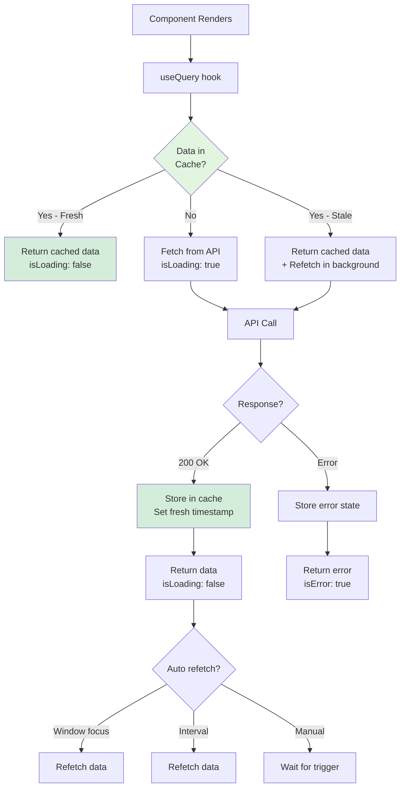

**Code Example**
```typescript
import { useQuery } from '@tanstack/react-query';

function UserList() {
  const { data, isLoading, error, refetch } = useQuery({
    queryKey: ['users'],
    queryFn: async () => {
      const response = await fetch('/api/users');
      if (!response.ok) throw new Error('Failed to fetch');
      return response.json();
    },
    staleTime: 5 * 60 * 1000, // 5 minutes
    refetchOnWindowFocus: true,
  });

  if (isLoading) return <Spinner />;
  if (error) return <Error error={error} retry={refetch} />;
  return <UserGrid users={data} />;
}
```

---

## 4. CRUD Operations Flow

```mermaid
graph TD
    subgraph Create POST
        C1[User fills form] --> C2[Submit]
        C2 --> C3[POST /api/users]
        C3 --> C4{Success?}
        C4 -->|Yes| C5[Add to list<br/>Show success]
        C4 -->|No| C6[Show error]
    end

    subgraph Read GET
        R1[Component mount] --> R2[GET /api/users]
        R2 --> R3[Display list]
    end

    subgraph Update PUT/PATCH
        U1[User edits item] --> U2[Submit changes]
        U2 --> U3[PUT /api/users/:id]
        U3 --> U4{Success?}
        U4 -->|Yes| U5[Update list<br/>Show success]
        U4 -->|No| U6[Show error]
    end

    subgraph Delete DELETE
        D1[User clicks delete] --> D2[Confirm dialog]
        D2 --> D3[DELETE /api/users/:id]
        D3 --> D4{Success?}
        D4 -->|Yes| D5[Remove from list<br/>Show success]
        D4 -->|No| D6[Show error]
    end

    style C5 fill:#d4edda
    style R3 fill:#d4edda
    style U5 fill:#d4edda
    style D5 fill:#d4edda
```

---

## 5. Optimistic Updates Pattern

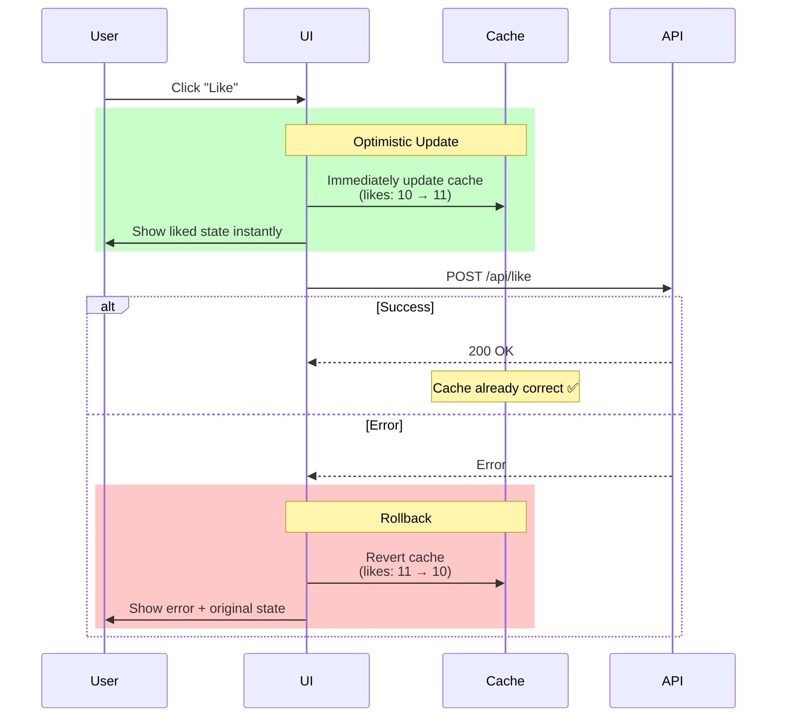

**Code Example with React Query**
```typescript
const { mutate: likePost } = useMutation({
  mutationFn: (postId: string) =>
    fetch(`/api/posts/${postId}/like`, { method: 'POST' }),

  // Optimistic update
  onMutate: async (postId) => {
    await queryClient.cancelQueries({ queryKey: ['posts'] });
    const previous = queryClient.getQueryData(['posts']);

    queryClient.setQueryData(['posts'], (old: Post[]) =>
      old.map(post =>
        post.id === postId
          ? { ...post, likes: post.likes + 1, isLiked: true }
          : post
      )
    );

    return { previous }; // For rollback
  },

  // Rollback on error
  onError: (err, postId, context) => {
    queryClient.setQueryData(['posts'], context.previous);
  },
});
```

---

## 6. Pagination Flow

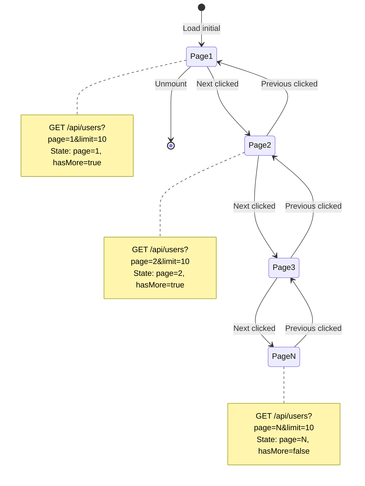

**Code Example**
```typescript
function PaginatedList() {
  const [page, setPage] = useState(1);
  const limit = 10;

  const { data, isLoading } = useQuery({
    queryKey: ['users', page],
    queryFn: async () => {
      const response = await fetch(
        `/api/users?page=${page}&limit=${limit}`
      );
      return response.json();
    },
    keepPreviousData: true, // Keep old data while fetching new
  });

  return (
    <>
      <UserList users={data?.users} loading={isLoading} />
      <Pagination
        page={page}
        totalPages={data?.totalPages}
        onNext={() => setPage(p => p + 1)}
        onPrevious={() => setPage(p => Math.max(1, p - 1))}
      />
    </>
  );
}
```

---

## 7. Infinite Scroll Flow

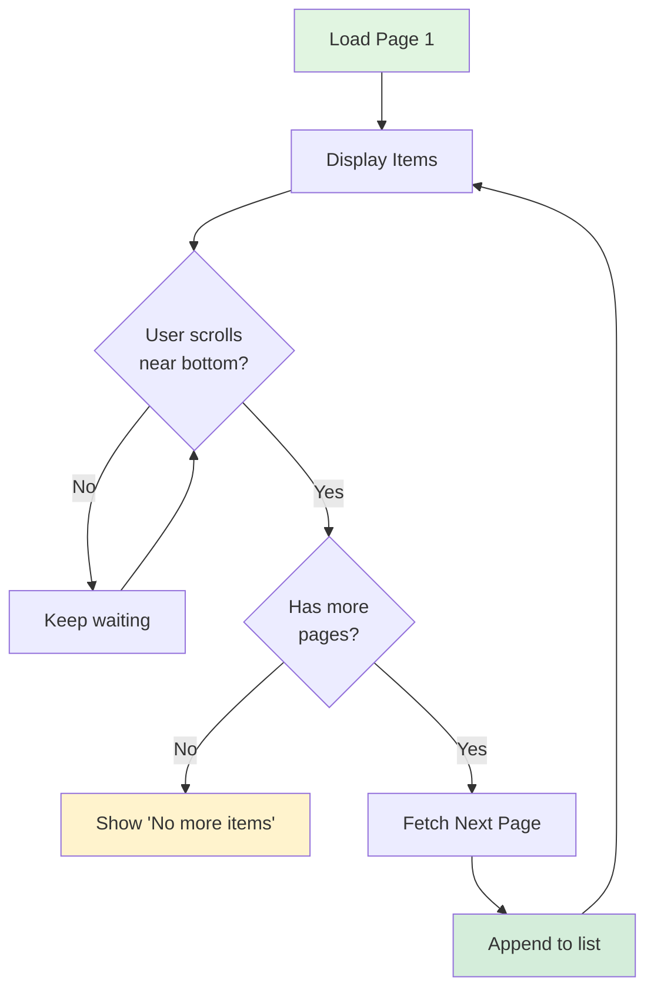

**Code Example**
```typescript
import { useInfiniteQuery } from '@tanstack/react-query';

function InfiniteUserList() {
  const {
    data,
    fetchNextPage,
    hasNextPage,
    isFetchingNextPage,
  } = useInfiniteQuery({
    queryKey: ['users-infinite'],
    queryFn: async ({ pageParam = 1 }) => {
      const response = await fetch(
        `/api/users?page=${pageParam}&limit=20`
      );
      return response.json();
    },
    getNextPageParam: (lastPage) =>
      lastPage.hasMore ? lastPage.nextPage : undefined,
  });

  const allUsers = data?.pages.flatMap(page => page.users) ?? [];

  return (
    <IntersectionObserver
      onIntersect={() => hasNextPage && fetchNextPage()}
    >
      <UserList users={allUsers} />
      {isFetchingNextPage && <Spinner />}
    </IntersectionObserver>
  );
}
```

---

## 8. Error Handling Strategies

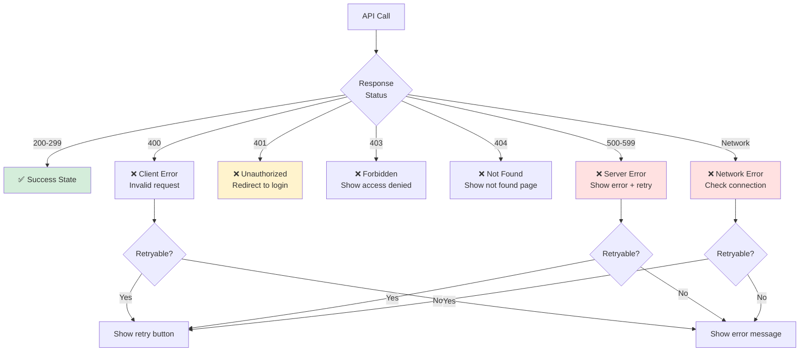

**Code Example**
```typescript
async function fetchWithErrorHandling(url: string) {
  try {
    const response = await fetch(url);

    if (!response.ok) {
      switch (response.status) {
        case 400:
          throw new Error('Invalid request. Please check your input.');
        case 401:
          // Redirect to login
          window.location.href = '/login';
          throw new Error('Unauthorized');
        case 403:
          throw new Error('Access denied');
        case 404:
          throw new Error('Resource not found');
        case 500:
        case 502:
        case 503:
          throw new Error('Server error. Please try again later.');
        default:
          throw new Error(`HTTP Error: ${response.status}`);
      }
    }

    return response.json();
  } catch (error) {
    if (error instanceof TypeError) {
      // Network error
      throw new Error('Network error. Check your internet connection.');
    }
    throw error;
  }
}
```

---

## 9. Loading States UI Patterns

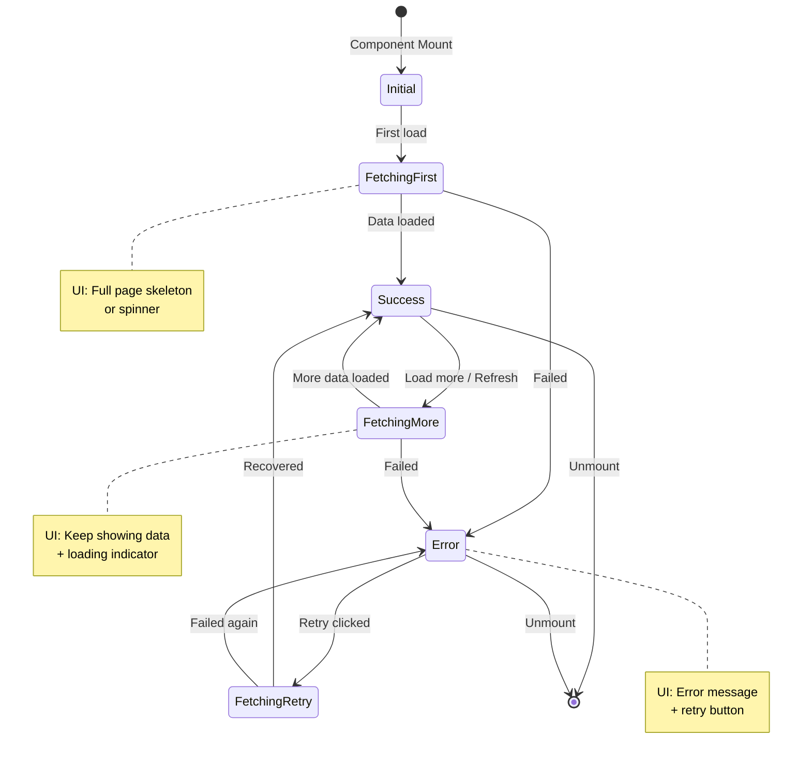

**UI Components**
```typescript
function DataView() {
  const { data, isLoading, isError, error } = useQuery({
    queryKey: ['data'],
    queryFn: fetchData,
  });

  // Initial loading
  if (isLoading && !data) {
    return <SkeletonLoader />;
  }

  // Error state
  if (isError) {
    return (
      <ErrorBoundary>
        <ErrorMessage error={error} />
        <RetryButton onClick={refetch} />
      </ErrorBoundary>
    );
  }

  // Success with optional background refresh
  return (
    <>
      {isLoading && <TopProgressBar />}
      <DataDisplay data={data} />
    </>
  );
}
```

---

## 10. Caching Strategy

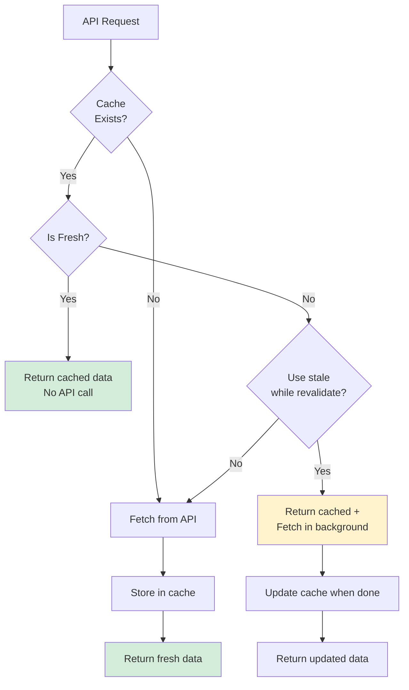

**React Query Cache Configuration**
```typescript
const queryClient = new QueryClient({
  defaultOptions: {
    queries: {
      staleTime: 5 * 60 * 1000, // 5 minutes - data considered fresh
      cacheTime: 10 * 60 * 1000, // 10 minutes - cache lifetime
      refetchOnWindowFocus: true, // Refetch when window focus
      refetchOnReconnect: true, // Refetch when reconnect
      retry: 3, // Retry failed requests 3 times
      retryDelay: (attemptIndex) => Math.min(1000 * 2 ** attemptIndex, 30000),
    },
  },
});
```

---

## 11. Full-Stack Data Flow

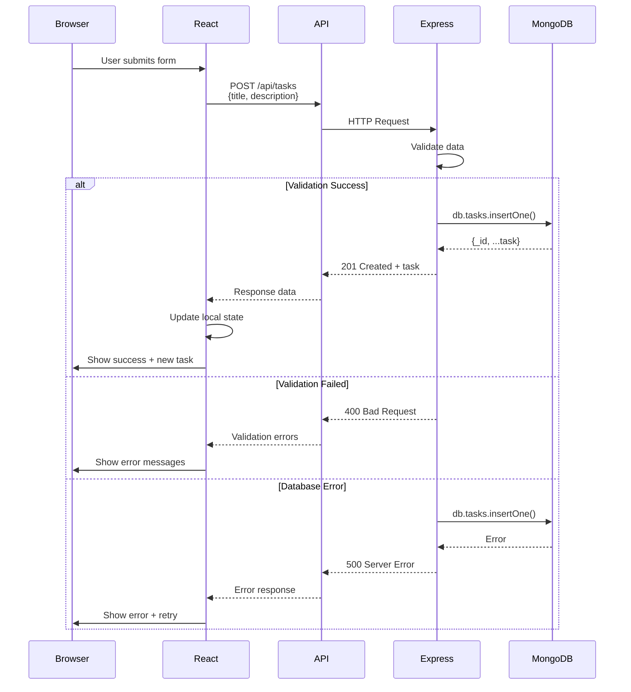

---

## 12. WebSocket Real-time Updates

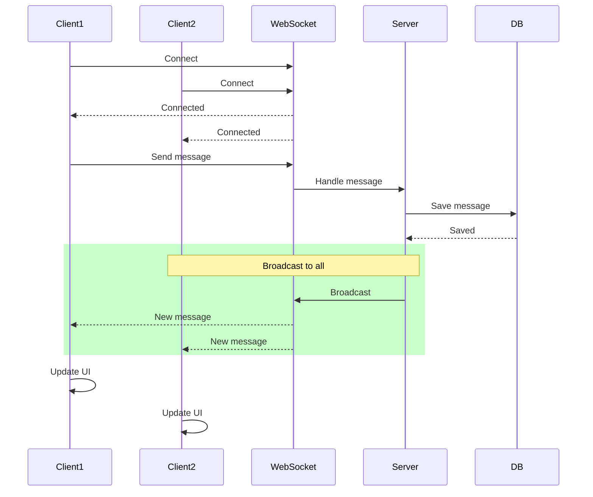

**Code Example**
```typescript
function useChatMessages() {
  const [messages, setMessages] = useState<Message[]>([]);
  const ws = useRef<WebSocket>();

  useEffect(() => {
    ws.current = new WebSocket('ws://localhost:3001');

    ws.current.onmessage = (event) => {
      const newMessage = JSON.parse(event.data);
      setMessages(prev => [...prev, newMessage]);
    };

    return () => ws.current?.close();
  }, []);

  const sendMessage = (text: string) => {
    ws.current?.send(JSON.stringify({ text }));
  };

  return { messages, sendMessage };
}
```

---

## 13. File Upload Flow

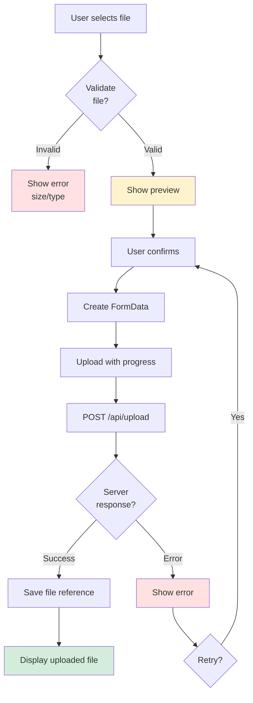

**Code Example**
```typescript
function FileUpload() {
  const [progress, setProgress] = useState(0);

  const uploadFile = async (file: File) => {
    const formData = new FormData();
    formData.append('file', file);

    const xhr = new XMLHttpRequest();

    xhr.upload.onprogress = (e) => {
      if (e.lengthComputable) {
        setProgress((e.loaded / e.total) * 100);
      }
    };

    xhr.onload = () => {
      if (xhr.status === 200) {
        const response = JSON.parse(xhr.responseText);
        console.log('Upload success:', response);
      }
    };

    xhr.open('POST', '/api/upload');
    xhr.send(formData);
  };

  return (
    <>
      <input type="file" onChange={(e) => uploadFile(e.target.files[0])} />
      {progress > 0 && <ProgressBar value={progress} />}
    </>
  );
}
```

---

**Created** October 6, 2025
**For** React Course - LongNDT
**Topic** API Integration & Data Flow
**Related Lessons** Lesson 3, Lesson 5
