# 🗺️ React Course Learning Roadmap (JavaScript)

---

## Visual Learning Path

```mermaid
graph TB
    Start([👋 Start Here]) --> L0[Lesson 0<br/>JavaScript ES6<br/>Prerequisites]

    L0 --> L1[📘 Lesson 1<br/>React Fundamentals<br/>⭐ Beginner]

    L1 --> L2[📘 Lesson 2<br/>Components & Hooks<br/>⭐⭐ Intermediate]

    L2 --> L3[📘 Lesson 3<br/>API & Data<br/>⭐⭐⭐ Intermediate-Advanced]

    L3 --> L4[📘 Lesson 4<br/>Routing & Auth<br/>⭐⭐⭐⭐ Advanced]

    L4 --> L5[📘 Lesson 5<br/>Full-Stack Deploy<br/>⭐⭐⭐⭐⭐ Advanced]

    L5 --> Extras[🎓 Extra Materials<br/>Advanced Topics]

    Extras --> Complete([Course Complete!<br/>Production Ready])

    style Start fill:#e1f5e1
    style Complete fill:#ffe1e1
    style L0 fill:#fff3cd
    style L1 fill:#cce5ff
    style L2 fill:#cce5ff
    style L3 fill:#cce5ff
    style L4 fill:#cce5ff
    style L5 fill:#cce5ff
    style Extras fill:#f8d7da
```

---

## JavaScript Learning Path

### 🎯 Lesson 0: JavaScript ES6 Prerequisites (Foundation)
**Difficulty** ⭐ Beginner **Time** 2-3 days **Requires** HTML, CSS, Basic JavaScript

```mermaid
flowchart TD
    A[Lesson 0 Start] --> B[JavaScript ES6 Basics]
    B --> C[Arrow Functions]
    C --> D[Destructuring]
    D --> E[Modules & Classes]
    E --> F[Lab: JavaScript Practice]
    F --> G{Quiz}
    G -->|Pass| H[✅ Lesson 0 Complete]
    G -->|Need Review| B

    style A fill:#e1f5e1
    style H fill:#d4edda
    style G fill:#fff3cd
    style D fill:#ffe1e1
    style E fill:#ffe1e1
```

** Key Topics**
- JavaScript ES6+ fundamentals
- Arrow functions and template literals
- Destructuring and spread operator
- Modules (import/export)
- Classes and inheritance
- Promises and async/await **JavaScript Features**
- Modern ES6+ syntax
- Module system
- Class-based programming
- Asynchronous programming
- Array methods and functional programming **Lab Project** JavaScript Practice Exercises

---

### 📘 Lesson 1: React Fundamentals with JavaScript

**Difficulty** ⭐ Beginner **Time** 1 week **Requires** Lesson 0

```mermaid
flowchart TD
    A[Lesson 1 Start] --> B[React Setup]
    B --> C[Components & JSX]
    C --> D[Props & State]
    D --> E[Event Handling]
    E --> F[Lab: Welcome Page]
    F --> G{Quiz}
    G -->|Pass| H[✅ Lesson 1 Complete]
    G -->|Need Review| B

    style A fill:#e1f5e1
    style H fill:#d4edda
    style G fill:#fff3cd
    style D fill:#ffe1e1
    style E fill:#ffe1e1
```

** Key Topics**
- JSX syntax and expressions
- Functional components
- Props and state management
- Event handling
- Virtual DOM concepts
- Vite setup with JavaScript **JavaScript Features**
- Component composition
- Props passing
- State management
- Event handling
- Lifecycle methods **Lab Project** Welcome Page Application (JavaScript)

---

### 📘 Lesson 2: Components & Hooks

**Difficulty** ⭐⭐ Intermediate **Time** 1-2 weeks **Requires** Lesson 1

```mermaid
flowchart TD
    A[Lesson 2 Start] --> B[State Management]
    B --> C[useState Hook]
    C --> D[useEffect Hook]
    D --> E[Custom Hooks]
    E --> F[Component Patterns]
    F --> G[Lab: Component Library]
    G --> H{Quiz}
    H -->|Pass| I[✅ Lesson 2 Complete]

    style A fill:#e1f5e1
    style I fill:#d4edda
    style H fill:#fff3cd
    style E fill:#ffe1e1
    style F fill:#ffe1e1
```

** Key Topics**
- useState with JavaScript
- useEffect for side effects
- useRef and useContext
- Custom hooks
- Component composition patterns
- Higher-Order Components (HOC)
- Render props pattern **JavaScript Features**
- Hook-based state management
- Custom hook creation
- Component patterns
- Context API
- Ref management **Lab Project** Reusable Component Library (JavaScript)

---

### 📘 Lesson 3: API Integration & Data

**Difficulty** ⭐⭐⭐ Intermediate-Advanced **Time** 2 weeks **Requires** Lessons 1-2

```mermaid
flowchart TD
    A[Lesson 3 Start] --> B[HTTP Basics]
    B --> C[Fetch API]
    C --> D[React Query/TanStack]
    D --> E[Backend Integration]
    E --> F[MongoDB + Express]
    F --> G[CRUD Operations]
    G --> H[Lab: Task Manager]
    H --> I{Quiz}
    I -->|Pass| J[✅ Lesson 3 Complete]

    style A fill:#e1f5e1
    style J fill:#d4edda
    style I fill:#fff3cd
    style D fill:#ffe1e1
    style F fill:#ffe1e1
```

** Key Topics**
- REST API with JavaScript
- HTTP methods and responses
- React Query for data fetching
- Loading and error states
- Backend with Express + JavaScript
- MongoDB with Mongoose
- CORS configuration **JavaScript Features**
- API integration
- Data fetching patterns
- Error handling
- State management for API data
- Backend development **Lab Project** Full-Stack Task Manager (JavaScript)

---

### 📘 Lesson 4: Routing & Authentication

**Difficulty** ⭐⭐⭐⭐ Advanced **Time** 2 weeks **Requires** Lessons 1-3

```mermaid
flowchart TD
    A[Lesson 4 Start] --> B[React Router v6]
    B --> C[Navigation & Links]
    C --> D[Dynamic Routes]
    D --> E[JWT Authentication]
    E --> F[Protected Routes]
    F --> G[Auth Context]
    G --> H[Lab: Auth System]
    H --> I{Quiz}
    I -->|Pass| J[✅ Lesson 4 Complete]

    style A fill:#e1f5e1
    style J fill:#d4edda
    style I fill:#fff3cd
    style E fill:#ffe1e1
    style F fill:#ffe1e1
```

** Key Topics**
- React Router v6 with JavaScript
- Navigation and routing
- URL parameters and query strings
- JWT authentication
- Login/Register forms
- Protected routes
- Auth context management **JavaScript Features**
- Client-side routing
- Authentication patterns
- Context API for auth
- Form handling
- Route protection **Lab Project** Authentication System (JavaScript)

---

### 📘 Lesson 5: Full-Stack & Deployment

**Difficulty** ⭐⭐⭐⭐⭐ Advanced **Time** 2-3 weeks **Requires** Lessons 1-4

```mermaid
flowchart TD
    A[Lesson 5 Start] --> B[Performance Optimization]
    B --> C[Code Splitting]
    C --> D[Lazy Loading]
    D --> E[Production Build]
    E --> F[Environment Config]
    F --> G[Deployment]
    G --> H[CI/CD]
    H --> I[Lab: Deploy App]
    I --> J{Quiz}
    J -->|Pass| K[✅ Lesson 5 Complete]

    style A fill:#e1f5e1
    style K fill:#d4edda
    style J fill:#fff3cd
    style B fill:#ffe1e1
    style G fill:#ffe1e1
```

** Key Topics**
- Performance optimization
- React.memo, useMemo, useCallback
- Code splitting with lazy loading
- Production builds
- Environment variables
- Deployment (Vercel, Netlify, Railway)
- Docker configuration
- CI/CD with GitHub Actions **JavaScript Features**
- Performance optimization
- Build optimization
- Deployment strategies
- Environment management
- CI/CD workflows **Lab Project** Production Deployment (JavaScript)

---

## 📚 Component Structure

```mermaid
graph TD
    Lesson[📁 Lesson X] --> Reference[📄 Reference<br/>Quick code snippets]
    Lesson --> Example[💻 Example<br/>Working projects]
    Lesson --> Theory[📖 Theory<br/>Concepts explained]
    Lesson --> Lab[🛠️ Lab<br/>Hands-on exercises]
    Lesson --> Quiz[❓ Quiz<br/>20 questions]
    Lesson --> Solutions[✅ Solutions<br/>Complete answers]

    style Lesson fill:#e7f3ff
    style Reference fill:#fff3cd
    style Example fill:#d4edda
    style Theory fill:#e1f5e1
    style Lab fill:#ffe1d4
    style Quiz fill:#ffd4ff
    style Solutions fill:#d4f4dd
```

---
