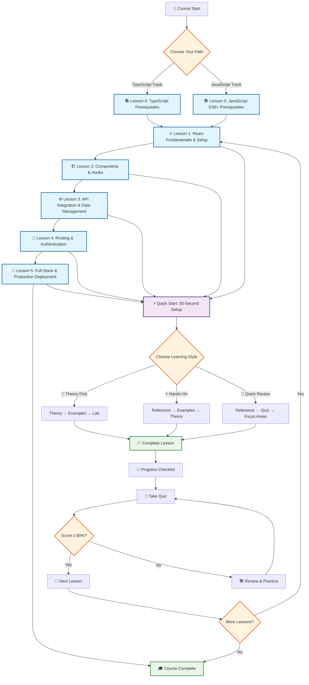
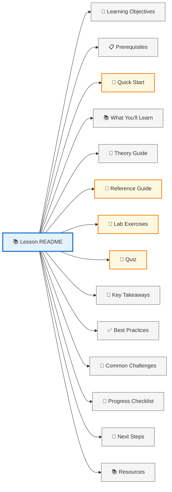
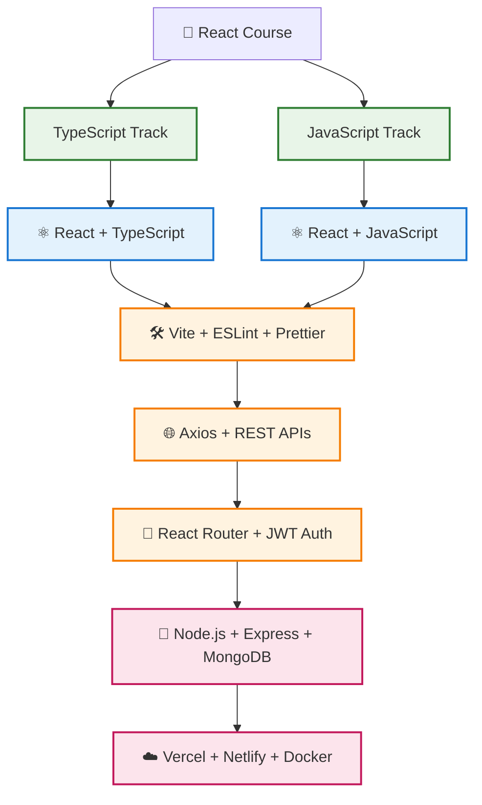
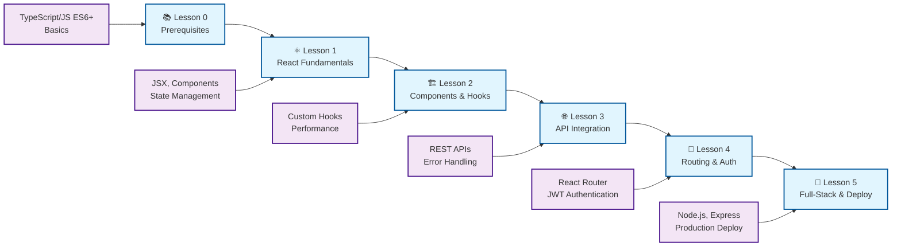
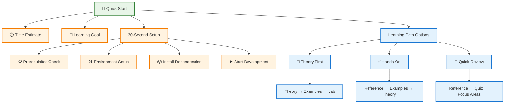

# React Course Structure Diagram

## Course Learning Path

## Lesson Structure Template

## Technology Stack

## Learning Objectives Progression

## Quick Start Flow

## Visual Elements Legend

- 🎯 **Learning Objectives** - Clear goals for each lesson
- 📋 **Prerequisites** - Required knowledge and setup
- 🚀 **Quick Start** - Fast setup and learning paths
- 📚 **What You'll Learn** - Detailed curriculum breakdown
- ⚛️ **React Components** - Component architecture and patterns
- 🎣 **Hooks** - State management and side effects
- 🌐 **API Integration** - Backend communication
- 🔐 **Authentication** - Security and user management
- 🚀 **Deployment** - Production and scaling
- ✅ **Best Practices** - Professional development standards
- 🚨 **Common Challenges** - Troubleshooting and solutions
- 📝 **Progress Tracking** - Checklists and assessments
- 🧪 **Quizzes** - Knowledge validation
- 📖 **Resources** - Additional learning materials
