# React Course Structure Diagram (JavaScript)

## Course Learning Path

```mermaid
graph TD
    A[🎯 Course Start] --> B[📚 Lesson 0: JavaScript ES6+ Prerequisites]

    B --> C[⚛️ Lesson 1: React Fundamentals & Setup]

    C --> D[🏗️ Lesson 2: Components & Hooks]
    D --> E[🌐 Lesson 3: API Integration & Data Management]
    E --> F[🔐 Lesson 4: Routing & Authentication]
    F --> G[🚀 Lesson 5: Full-Stack & Production Deployment]

    G --> H[🎓 Course Complete]

    %% Quick Start Paths
    C --> I[⚡ Quick Start: 30-Second Setup]
    D --> I
    E --> I
    F --> I
    G --> I

    %% Learning Styles
    I --> J{Choose Learning Style}
    J -->|📖 Theory First| K[Theory → Examples → Lab]
    J -->|⚡ Hands-On| L[Reference → Examples → Theory]
    J -->|🎯 Quick Review| M[Reference → Quiz → Focus Areas]

    K --> N[✅ Complete Lesson]
    L --> N
    M --> N

    N --> O[📝 Progress Checklist]
    O --> P[🧪 Take Quiz]
    P --> Q{Score ≥ 80%?}
    Q -->|Yes| R[🚀 Next Lesson]
    Q -->|No| S[📚 Review & Practice]
    S --> P

    R --> T{More Lessons?}
    T -->|Yes| C
    T -->|No| H

    %% Styling
    classDef lesson fill:#e1f5fe,stroke:#01579b,stroke-width:2px
    classDef quickstart fill:#f3e5f5,stroke:#4a148c,stroke-width:2px
    classDef decision fill:#fff3e0,stroke:#e65100,stroke-width:2px
    classDef complete fill:#e8f5e8,stroke:#2e7d32,stroke-width:2px

    class B,C,D,E,F,G lesson
    class I quickstart
    class J,Q,T decision
    class H,N complete
```

## Lesson Structure Template

```mermaid
graph LR
    A[📚 Lesson README] --> B[🎯 Learning Objectives]
    A --> C[📋 Prerequisites]
    A --> D[🚀 Quick Start]
    A --> E[📚 What You'll Learn]
    A --> F[📖 Theory Guide]
    A --> G[📖 Reference Guide]
    A --> H[🧪 Lab Exercises]
    A --> I[📝 Quiz]
    A --> J[🎯 Key Takeaways]
    A --> K[✅ Best Practices]
    A --> L[🚨 Common Challenges]
    A --> M[📝 Progress Checklist]
    A --> N[🚀 Next Steps]
    A --> O[📚 Resources]

    %% Styling
    classDef main fill:#e3f2fd,stroke:#1976d2,stroke-width:3px
    classDef content fill:#f5f5f5,stroke:#616161,stroke-width:1px
    classDef interactive fill:#fff8e1,stroke:#f57c00,stroke-width:2px

    class A main
    class B,C,E,F,J,K,L,M,N,O content
    class D,G,H,I interactive
```

## JavaScript Technology Stack

```mermaid
graph TB
    A[🎯 React Course - JavaScript Track] --> B[⚛️ React + JavaScript]

    B --> C[🛠️ Vite + ESLint + Prettier + JavaScript]

    C --> D[🌐 Axios + REST APIs + JavaScript]
    D --> E[🔐 React Router + JWT Auth + JavaScript]
    E --> F[🚀 Node.js + Express + MongoDB + JavaScript]
    F --> G[☁️ Vercel + Netlify + Docker + JavaScript]

    %% Styling
    classDef track fill:#e8f5e8,stroke:#2e7d32,stroke-width:2px
    classDef tech fill:#e3f2fd,stroke:#1976d2,stroke-width:2px
    classDef tools fill:#fff3e0,stroke:#f57c00,stroke-width:2px
    classDef deploy fill:#fce4ec,stroke:#c2185b,stroke-width:2px

    class A track
    class B tech
    class C,D,E tools
    class F,G deploy
```

## Learning Objectives Progression

```mermaid
graph LR
    A[📚 Lesson 0<br/>JavaScript ES6+ Prerequisites] --> B[⚛️ Lesson 1<br/>React Fundamentals]
    B --> C[🏗️ Lesson 2<br/>Components & Hooks]
    C --> D[🌐 Lesson 3<br/>API Integration]
    D --> E[🔐 Lesson 4<br/>Routing & Auth]
    E --> F[🚀 Lesson 5<br/>Full-Stack & Deploy]

    A1[JavaScript ES6+<br/>Modern JavaScript] --> A
    B1[JSX + JavaScript<br/>Component Patterns] --> B
    C1[Custom Hooks<br/>JavaScript Hooks] --> C
    D1[REST APIs<br/>JavaScript API Calls] --> D
    E1[React Router<br/>JavaScript Auth] --> E
    F1[Node.js + Express<br/>JavaScript Backend] --> F

    %% Styling
    classDef lesson fill:#e1f5fe,stroke:#01579b,stroke-width:2px
    classDef skills fill:#f3e5f5,stroke:#4a148c,stroke-width:2px

    class A,B,C,D,E,F lesson
    class A1,B1,C1,D1,E1,F1 skills
```

## Quick Start Flow

```mermaid
graph TD
    A[🚀 Quick Start - JavaScript] --> B[⏱️ Time Estimate]
    A --> C[🎯 Learning Goal]
    A --> D[30-Second Setup]
    A --> E[Learning Path Options]

    D --> F[📋 JavaScript Prerequisites Check]
    D --> G[🛠️ JavaScript Environment Setup]
    D --> H[📦 Install Dependencies + JavaScript]
    D --> I[▶️ Start Development with JavaScript]

    E --> J[📖 Theory First]
    E --> K[⚡ Hands-On]
    E --> L[🎯 Quick Review]

    J --> M[Theory → Examples → Lab]
    K --> N[Reference → Examples → Theory]
    L --> O[Reference → Quiz → Focus Areas]

    %% Styling
    classDef quickstart fill:#e8f5e8,stroke:#2e7d32,stroke-width:2px
    classDef setup fill:#fff3e0,stroke:#f57c00,stroke-width:2px
    classDef path fill:#e3f2fd,stroke:#1976d2,stroke-width:2px

    class A quickstart
    class B,C,D,F,G,H,I setup
    class E,J,K,L,M,N,O path
```

## JavaScript-Specific Features

```mermaid
graph TB
    A[🎯 JavaScript React Course] --> B[📝 Modern JavaScript]
    A --> C[🔧 Development Tools]
    A --> D[🏗️ Architecture Patterns]

    B --> B1[ES6+ Features]
    B --> B2[Arrow Functions]
    B --> B3[Destructuring]
    B --> B4[Modules & Classes]

    C --> C1[JavaScript Compiler]
    C --> C2[ESLint + JavaScript]
    C --> C3[Browser DevTools]
    C --> C4[Error Handling]

    D --> D1[Component Props]
    D --> D2[Hook Patterns]
    D --> D3[API Integration]
    D --> D4[Context Usage]

    %% Styling
    classDef main fill:#e8f5e8,stroke:#2e7d32,stroke-width:2px
    classDef category fill:#e3f2fd,stroke:#1976d2,stroke-width:2px
    classDef feature fill:#fff3e0,stroke:#f57c00,stroke-width:2px

    class A main
    class B,C,D category
    class B1,B2,B3,B4,C1,C2,C3,C4,D1,D2,D3,D4 feature
```

## Visual Elements Legend

- 🎯 **Learning Objectives** - Clear goals for each lesson
- 📋 **Prerequisites** - Required JavaScript knowledge and setup
- 🚀 **Quick Start** - Fast JavaScript setup and learning paths
- 📚 **What You'll Learn** - Detailed JavaScript curriculum breakdown
- ⚛️ **React Components** - JavaScript component architecture and patterns
- 🎣 **Hooks** - JavaScript state management and side effects
- 🌐 **API Integration** - JavaScript backend communication
- 🔐 **Authentication** - JavaScript security and user management
- 🚀 **Deployment** - JavaScript production and scaling
- ✅ **Best Practices** - JavaScript professional development standards
- 🚨 **Common Challenges** - JavaScript troubleshooting and solutions
- 📝 **Progress Tracking** - JavaScript checklists and assessments
- 🧪 **Quizzes** - JavaScript knowledge validation
- 📖 **Resources** - Additional JavaScript learning materials