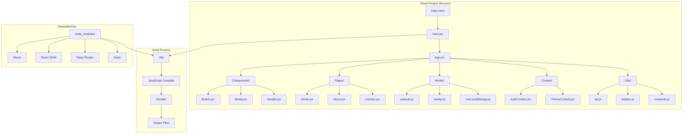
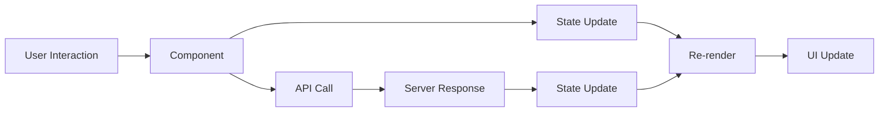
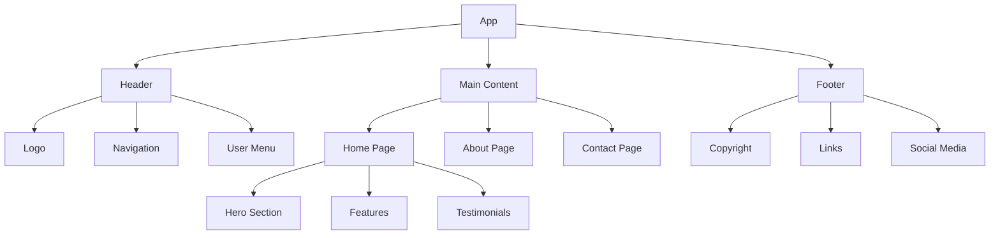
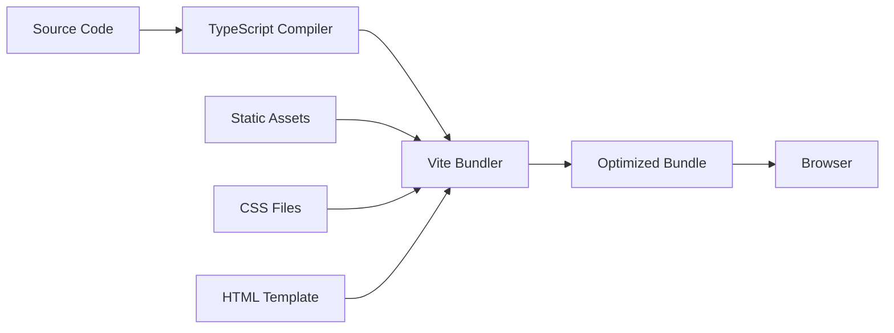

# React Project Structure Diagram (JavaScript)

## Overview

This diagram illustrates the typical structure and organization of a React project using JavaScript, showing how different parts work together.

> 📁 **Related Theory** For detailed explanations of React project structure, see [React Fundamentals Theory](../../lesson1-fundamentals-setup/theory/theory1.md)

## Project Structure Flow



## File Organization

### Core Files
- **`index.html`**- HTML template
- **`main.tsx`**- Application entry point
- **`App.tsx`**- Root component

### Source Structure
```
src/
├── components/          # Reusable UI components
│   ├── Button.tsx
│   ├── Modal.tsx
│   └── Header.tsx
├── pages/              # Page components
│   ├── Home.tsx
│   ├── About.tsx
│   └── Contact.tsx
├── hooks/              # Custom hooks
│   ├── useAuth.ts
│   ├── useApi.ts
│   └── useLocalStorage.ts
├── context/            # React Context providers
│   ├── AuthContext.tsx
│   └── ThemeContext.tsx
├── utils/              # Utility functions
│   ├── api.ts
│   ├── helpers.ts
│   └── constants.ts
├── types/              # Type definitions (JSDoc)
│   └── index.ts
├── styles/             # CSS files
│   ├── App.css
│   └── index.css
└── assets/             # Static assets
    ├── images/
    └── icons/
```

## Data Flow



## Component Hierarchy



## Build Process



## Key Concepts

### 1. **Component-Based Architecture**
- Reusable, modular components
- Clear separation of concerns
- Easy to test and maintain

### 2. **File Organization**
- Logical grouping by functionality
- Consistent naming conventions
- Clear import/export structure

### 3. **Build Process**
- TypeScript compilation
- Module bundling
- Asset optimization
- Development server

### 4. **Development Workflow**
- Hot module replacement
- Type checking
- Linting and formatting
- Testing integration

## Best Practices

### File Naming
- **Components** PascalCase (e.g., `UserProfile.tsx`)
- **Hooks** camelCase with `use` prefix (e.g., `useAuth.ts`)
- **Utils** camelCase (e.g., `apiHelpers.ts`)
- **Types** PascalCase (e.g., `UserTypes.ts`)

### Import Organization
```javascript
// 1. React imports
import React, { useState, useEffect } from 'react';

// 2. Third-party libraries
import axios from 'axios';
import { BrowserRouter } from 'react-router-dom';

// 3. Internal components
import { Header } from './components/Header';
import { Footer } from './components/Footer';

// 4. Utils and types
import { apiClient } from '../utils/api';
// Note: In JavaScript, we don't need explicit type imports
```

### Component Structure
```javascript
// 1. Imports
// 2. Types/Interfaces
// 3. Component definition
// 4. Export
```

## Related Diagrams

- [Course Roadmap](./COURSE_ROADMAP.md) - Overall learning path
- [Component Lifecycle](./COMPONENT_LIFECYCLE.md) - Component behavior
- [Project Architecture](./PROJECT_ARCHITECTURE.md) - Full-stack architecture
